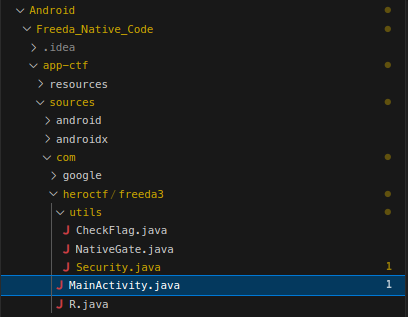
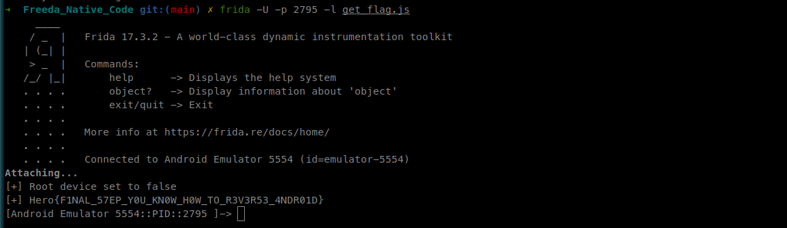

# Freeda Native Hook

### Category

Android

### Difficulty

Hard

### Tags

- android
- frida
- java
- cpp

### Author

Thib

### Description

Try to find the password to open this vault! 

I was told that it was dangerous to let my application install on a rooted machine. I fixed the problem!
I was also told that it was safer to move sensitive functions from my code to a native library, so that's what I did!

Don't waste too much time statically analyzing the application; there are much faster ways. 

### Files

- [app-ctf.apk](app-ctf.apk)

### Write Up

In order to solve the challenge, the first step is to launch an Android virtual device (AVD) and install the application to see what it actually looks like. In the write-up I will use Android Studio AVD.

```bash
$ adb devices
List of devices attached
emulator-5554	device
```

Let's install the APK on our device :

```bash
$ adb install app-release.apk 
Performing Streamed Install
Success

$ adb shell pm list packages -f | grep heroctf                
package:/data/app/~~1b4poT6kV7AblviUcZHcmA==/com.heroctf.freeda3-RTYZc77Wi--VPkkhLnipwQ==/base.apk=com.heroctf.freeda3
```

I'm going to use JADX to decompile the APK and retrieve readable Java code.

```bash
$ jadx app-release.apk
INFO  - loading ...
INFO  - processing ...
INFO  - done                         
```

As we saw in the previous adb command, the package name is `com.heroctf.freeda3`, so the Java code for the main activity is located in the folder with the same path.



We can see that there is a new `NativeGate.java` file. We can guess that a native library is being used.

```java
package com.heroctf.freeda3.utils;

public final class NativeGate {
    static { System.loadLibrary("v3"); }  // => libv3.so
    public static native boolean nCheck(String input);
    private NativeGate() {}
}
```

These lines allow the application to load a native library called `libv3.so`, which will export a function named `nCheck(String str)`.

This line in CheckFlag.java suggests that this exported function checks the user's input : 

```java
public abstract class CheckFlag {
    public static boolean checkFlag(String input) {
        if (input == null) {
            return false;
        }
        return NativeGate.nCheck(input);
    }
}
```

To understand how the function works, we will use Ghidra and we will open the library located here: `resources/lib/x86_64/libv3.so`.

What's convenient is that exported functions for Android applications are prefixed with `Java*`. The function can therefore be easily found with Ghidra :

```cpp
bool Java_com_heroctf_freeda3_utils_NativeGate_nCheck(long *param_1,undefined8 param_2,long param_3)

{
  int iVar1;
  void *__s2;
  void *__s1;
  
  if (param_3 != 0) {
    __s2 = (void *)get_flag();
    iVar1 = (**(code **)(*param_1 + 0x540))(param_1,param_3);
    if (iVar1 == 0x30) {
      __s1 = (void *)(**(code **)(*param_1 + 0x548))(param_1,param_3,0);
      if (__s1 == (void *)0x0) {
        return false;
      }
      iVar1 = memcmp(__s1,__s2,0x30);
      (**(code **)(*param_1 + 0x550))(param_1,param_3,__s1);
      return iVar1 == 0;
    }
  }
  return false;
}
```

We don't need to look any further; we find a `get_flag()` function. Given the previous challenges, it becomes obvious that we will need to use Frida to hook this function. 

The goal will be to find the address of the get_flag function in the library, hook it, and then launch it.

Here is the list of commands :

```js
var addr = Process.getModuleByName('libv3.so').findExportByName('get_flag');
var getFlag = new NativeFunction(ptr(addr), 'pointer', []);
var p = getFlag();
p.readCString();
```

Line-by-line breakdown:

`Process.getModuleByName(‘libv3.so’).findExportByName('get_flag')` Finds the address of the get_flag export in the loaded libv3.so library (ASLR managed by Frida).

`new NativeFunction(ptr(addr), ‘pointer’, [])`  Wraps the previous address as a C function with no arguments that returns a pointer.

`getFlag()` Calls the function, the result p is a NativePointer (char *).

`p.readCString()` Reads the null-terminated string at this address and returns it (UTF-8).

One small difference, however, is that the library is not loaded immediately into the application, so the most practical approach is to attach to script to an existing process.

```
$ frida-ps -Uai | grep com.hero  
2505  freeda3                  com.heroctf.freeda3

$ frida -U -p 2505 -l get_flag.js
     ____
    / _  |   Frida 17.3.2 - A world-class dynamic instrumentation toolkit
   | (_| |
    > _  |   Commands:
   /_/ |_|       help      -> Displays the help system
   . . . .       object?   -> Display information about 'object'
   . . . .       exit/quit -> Exit
   . . . .
   . . . .   More info at https://frida.re/docs/home/
   . . . .
   . . . .   Connected to Android Emulator 5554 (id=emulator-5554)
Attaching...                                                            
Root detected - flag unavailable
```

`Root detected - flag unavailable` ; oh no, it looks like we missed something. Lets go back to Ghidra.

```cpp
char * get_flag(void)

{
  int iVar1;
  
  if (DAT_001054f4 != 0) {
    return &DAT_001054c0;
  }
  iVar1 = check_root();
  if (iVar1 != 0) {
    FUN_00102870();
    DAT_001054f4 = 1;
    return &DAT_001054c0;
  }
  return "Root detected - flag unavailable";
}
```

Looking at the get_flag function, we see that a `check_root()` function is called, and if the result is equal to 0, then the code returns “Root detected - flag unavailable,” considering that the device is rooted. We must therefore rewrite the output value to make it appear that the device is not rooted.

```js
var addr = Process.getModuleByName('libv3.so').findExportByName('check_root'); 
Interceptor.replace(addr, new NativeCallback(function () {
  return 1; 
}, "int", []));
```

The script works like the one above: we hook the function that checks the flag by finding its address, then we rewrite its return value. The value will always be 1, as if the device were not rooted

Now we can combine the two parts:

```js
Java.perform(function () {
  var addr = Process.getModuleByName('libv3.so').findExportByName('check_root'); 
  Interceptor.replace(addr, new NativeCallback(function () {
    return 1; // OK
  }, "int", []));
  console.log("[+] Root device set to false")

  var addr = Process.getModuleByName('libv3.so').findExportByName('get_flag'); 
  var getFlag = new NativeFunction(ptr(addr), 'pointer', []); 
  var p = getFlag(); 
  console.log("[+]",p.readCString());
});
```

And here is the flag !



### Flag

Hero{F1NAL_57EP_Y0U_KN0W_H0W_TO_R3V3R53_4NDR01D}