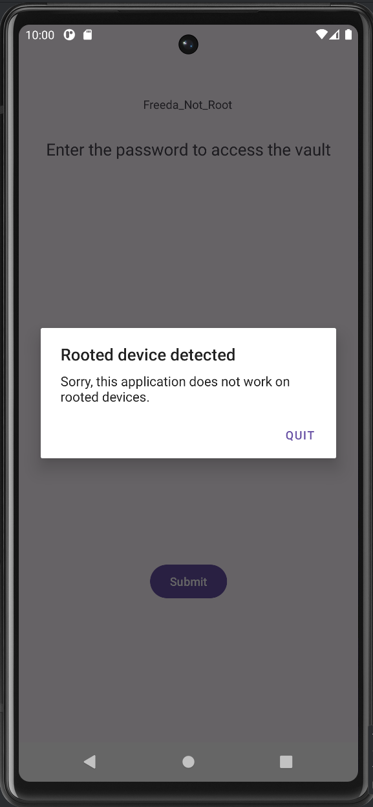
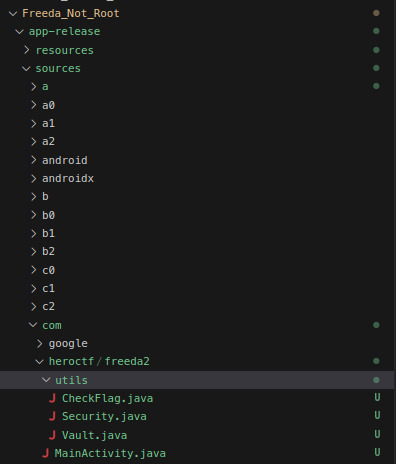
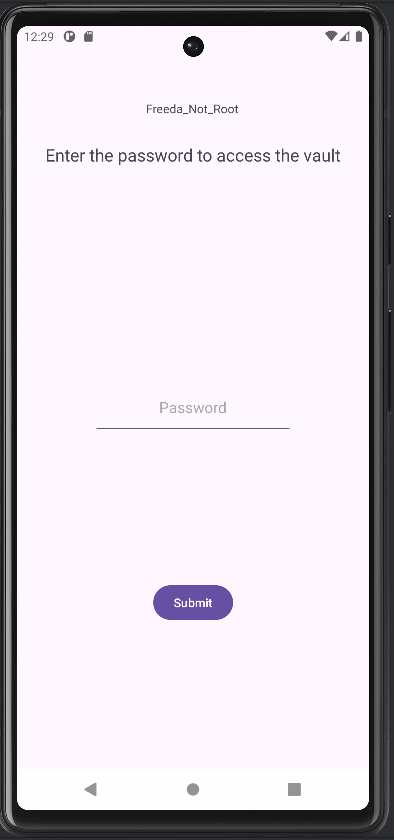

# Freeda Not Root

### Category

Android

### Difficulty

Medium

### Tags

- android
- frida
- java

### Author

Thib

### Description

Try to find the password to open this vault! 

I was told that it was dangerous to let my application install on a rooted machine. I fixed the problem!

Don't waste too much time statically analyzing the application; there are much faster ways. 

### Files

- [app-release.apk](app-release.apk)

### Write Up

In order to solve the challenge, the first step is to launch an Android virtual device (AVD) and install the application to see what it actually looks like. In the write-up I will use Android Studio AVD.

```bash
$ adb devices
List of devices attached
emulator-5554	device
```

Let's install the APK on our device :

```bash
$ adb install app-release.apk 
Performing Streamed Install
Success

$ adb shell pm list packages -f | grep heroctf                
package:/data/app/~~ogr3ISstUrFLheuhQvmkCg==/com.heroctf.freeda2-cdulSOnQ_hOre01wuy7ipA==/base.apk=com.heroctf.freeda2
```

When launching the APK, we realize that the application detects that the AVD is rooted and it is not possible to enter passwords.



So I'm going to use JADX to decompile the APK and retrieve readable Java code.

```bash
$ jadx app-release.apk
INFO  - loading ...
INFO  - processing ...
INFO  - done                         
```

As we saw in the previous adb command, the package name is com.heroctf.freeda2, so the Java code for the main activity is located in the folder with the same path.

The obfuscation seems stronger than in the previous challenge, but the path is still the same.



We can see that there is a new Security.java file.

```java
public final class Security {
    private Security() {
    }

    public static boolean detectRoot(Context context) {
        return new RootBeer(context).isRooted();
    }
}
```

We can guess that it is used to check whether the device running the application is rooted or not.

The rest of the code appears to be similar. Therefore, a script must be written to rewrite the output value of the anti-root check and retrieve the value returned by `get_flag()`.

```java
public static java.lang.String get_flag() {
    /*
        Method dump skipped, instructions count: 435
        To view this dump add '--comments-level debug' option
    */
    throw new UnsupportedOperationException("Method not decompiled: com.heroctf.freeda2.utils.Vault.get_flag():java.lang.String");
```

Let's write the Frida script to bypass the anti-root detection :

```js
Java.perform(function () {
  var Sec = Java.use('com.heroctf.freeda2.utils.Security');
  Sec.detectRoot.overload('android.content.Context').implementation = function (ctx) {
    return false;
  };
```

Let's try to understand it line by line.

`Java.perform(function () { ... })` Runs the code when the Android Java environment is initialized.

`var Sec = Java.use(‘com.heroctf.freeda2.utils.Security’);` Creates a Frida proxy to the Security class.

`Sec.detectRoot.overload(‘android.content.Context’).implementation = function (ctx) { return false; };` Selects the detectRoot(Context) overload and replaces its code with a function that ignores the original logic and always returns false.

This technique ensures that the detectRoot() method always returns false, as if the device were not rooted.

Then, we can spawn the app with `-f`, select emulator device with `-U` and our script with `-l` (don't forget to run frida-server on the device)

```
$ frida -U -f com.heroctf.freeda2 -l bypass_antiroot.js
```

We note that the anti-root popup no longer appears.



It is now possible to retrieve the flag as in the previous challenge. Here is the complete script: 

```js
Java.perform(function () {

  // anti-root bypass
  var Sec = Java.use('com.heroctf.freeda2.utils.Security');
  Sec.detectRoot.overload('android.content.Context').implementation = function (ctx) {
    return false;
  };

  // get the flag
  var Vault = Java.use('com.heroctf.freeda2.utils.Vault');
  var flag = Vault.get_flag();
  console.log('[FLAG] ' + flag);
});
```

```
frida -U -f com.heroctf.freeda2 -l get_flag.js 
     ____
    / _  |   Frida 17.3.2 - A world-class dynamic instrumentation toolkit
   | (_| |
    > _  |   Commands:
   /_/ |_|       help      -> Displays the help system
   . . . .       object?   -> Display information about 'object'
   . . . .       exit/quit -> Exit
   . . . .
   . . . .   More info at https://frida.re/docs/home/
   . . . .
   . . . .   Connected to Android Emulator 5554 (id=emulator-5554)
Spawned `com.heroctf.freeda2`. Resuming main thread!                    
[Android Emulator 5554::com.heroctf.freeda2 ]-> [FLAG] HERO{D1D_Y0U_U53_0BJ3C71ON?}
```

### Flag

HERO{D1D_Y0U_U53_0BJ3C71ON?}