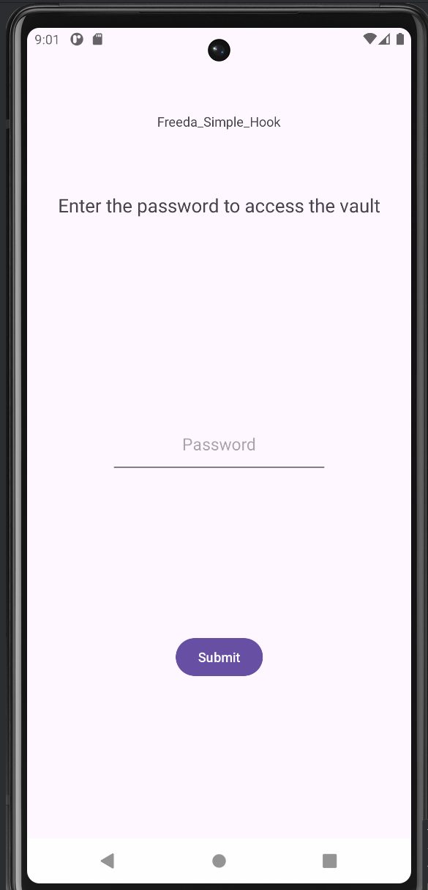
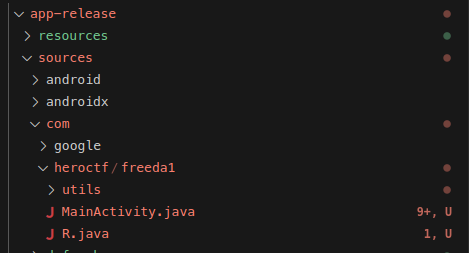

# Freeda Simple Hook

### Category

Android

### Difficulty

Easy

### Tags

- android
- frida
- java

### Author

Thib

### Description

Try to find the password to open this vault! 

Don't waste too much time statically analyzing the application; there are much faster ways. 

### Files

- [app-release.apk](app-release.apk)

### Write Up

In order to solve the challenge, the first step is to launch an Android virtual device (AVD) and install the application to see what it actually looks like. In the write-up I will use Android Studio AVD.

```bash
$ adb devices
List of devices attached
emulator-5554	device
```

Let's install the APK on our device :

```bash
$ adb install app-release.apk 
Performing Streamed Install
Success

$ adb shell pm list packages -f | grep heroctf                
package:/data/app/~~Qf17CJsA5uzmNW008Fdjtg==/com.heroctf.freeda1-H8Yx-KMzw5UwnNGt3IYBtA==/base.apk=com.heroctf.freeda1
```

The main menu is fairly simple, and there aren't many clues about the challenge. So you have to look at the code.



So I'm going to use JADX to decompile the APK and retrieve readable Java code.

```bash
$ jadx app-release.apk
INFO  - loading ...
INFO  - processing ...
INFO  - done                         
```

As we saw in the previous adb command, the package name is com.heroctf.freeda1, so the Java code for the main activity is located in the folder with the same path.



The MainActivity.java file is of particular interest to us because it contains the Java code responsible for the application's main page. The `onCreate()` method is called when the activity is created. In our case, this is the main activity, so this code will be called at the very beginning.

```java
// MainActivity.java
public final void onCreate(Bundle bundle) throws IllegalAccessException, NoSuchMethodException, SecurityException, IllegalArgumentException, InvocationTargetException {
        super.onCreate(bundle);
        bc bcVar = new bc(3);
        ku kuVar = new ku(0, 0, bcVar);
        int i = yc.a;
        int i2 = yc.b;
        bc bcVar2 = new bc(3);
        ku kuVar2 = new ku(i, i2, bcVar2);
        View decorView = getWindow().getDecorView();
        vi.p(decorView, "getDecorView(...)");
        Resources resources = decorView.getResources();
        vi.p(resources, "getResources(...)");
        boolean zBooleanValue = ((Boolean) bcVar.b(resources)).booleanValue();
        Resources resources2 = decorView.getResources();
        vi.p(resources2, "getResources(...)");
        boolean zBooleanValue2 = ((Boolean) bcVar2.b(resources2)).booleanValue();
        cd cdVar = new cd();
        Window window = getWindow();
        vi.p(window, "getWindow(...)");
        cdVar.a(kuVar, kuVar2, window, decorView, zBooleanValue, zBooleanValue2);
        Window window2 = getWindow();
        vi.p(window2, "getWindow(...)");
        cdVar.b(window2);
        setContentView(R.layout.activity_main);
        View viewFindViewById = findViewById(R.id.main);
        bc bcVar3 = new bc(2);
        WeakHashMap weakHashMap = tx.a;
        jx.u(viewFindViewById, bcVar3);
        this.y = (Button) findViewById(R.id.submitButton);
        this.z = (EditText) findViewById(R.id.flagInput);
        this.A = (TextView) findViewById(R.id.passwordStatus);
        this.y.setOnClickListener(new c8(2, this));
    }
```

But... Why does it look like nothing and why can't we understand it? Because the application was compiled with Proguard/R8 rules, making it more difficult to decompile.

But considering the instructions, this is normal and we shouldn't waste too much time on it. Let's continue our analysis. Looking at the other Java files, we see that there is a checkFlag method:

```java
public class CheckFlag {
    public static boolean checkFlag(String str) {
        if (str == null) {
            return false;
        }
        try {
            String str2 = "get_flag";
            Method declaredMethod = Class.forName("com.heroctf.freeda1.utils" + "." + "Vault").getDeclaredMethod(str2, null);
            declaredMethod.setAccessible(true);
            return ((String) declaredMethod.invoke(null, null)).equals(str);
        } catch (Throwable unused) {
            return false;
        }
    }
}
```

We understand that it takes a character string as a parameter and returns a boolean value.

It is easy to understand that this method is responsible for checking the user's input. But how does it works ? This part is the core of the challenge :

```java
String str2 = "get_flag";
Method declaredMethod = Class.forName("com.heroctf.freeda1.utils" + "." + "Vault").getDeclaredMethod(str2, null);
declaredMethod.setAccessible(true);
return ((String) declaredMethod.invoke(null, null)).equals(str);
```

This small piece of code retrieves an object representing a Java method with a name corresponding to the character string passed as a parameter. So, this small piece of code retrieves a method called `get_flag()` and launches it. The result will be compared with the string entered by the user.

We don't need to know any more than that; we just need to know what the `get_flag()` method returns. Frida is the best option for our case.

Let's write a little script.

```js
Java.perform(function () {
    var Vault = Java.use('com.heroctf.freeda1.utils.Vault');
    var flag = Vault.get_flag();
    console.log('[FLAG]' + flag);
});
```

Let's try to understand it line by line.

`Java.perform(function () { ... })` Executes the function when the Android Java environment is initialized (otherwise the classes are not accessible).

`var Vault = Java.use(‘com.heroctf.freeda1.utils.Vault’);` Retrieves a copy from the Java class. From there, it is possible to call its methods.

`var flag = Vault.get_flag();` Calls the static method `get_flag()` from Vault.

`console.log(‘[FLAG]’ + flag);` Displays the return value of get_flag() in the Frida console.

Before launching the script, we have to make sure that Frida-Server is running on our device (must be root) : 

```
$ adb push frida-server-17.3.2-android-x86 /data/local/tmp
$ adb shell
# cd /data/local/tmp
# chmod +x frida-server-17.3.2-android-x86
# ./frida-server-17.3.2-android-x86 &
```

Then, we can spawn the app with `-f`, select emulator device with `-U` and our script with `-l` on our host.

```
frida -U -f com.heroctf.freeda1 -l get_flag.js 
     ____
    / _  |   Frida 17.3.2 - A world-class dynamic instrumentation toolkit
   | (_| |
    > _  |   Commands:
   /_/ |_|       help      -> Displays the help system
   . . . .       object?   -> Display information about 'object'
   . . . .       exit/quit -> Exit
   . . . .
   . . . .   More info at https://frida.re/docs/home/
   . . . .
   . . . .   Connected to Android Emulator 5554 (id=emulator-5554)
Spawned `com.heroctf.freeda1`. Resuming main thread!                    
[Android Emulator 5554::com.heroctf.freeda1 ]-> START
[FLAG]Hero{1_H0P3_Y0U_D1DN'T_S7A71C_4N4LYZ3D}
```

### Flag

Hero{1_H0P3_Y0U_D1DN'T_S7A71C_4N4LYZ3D}