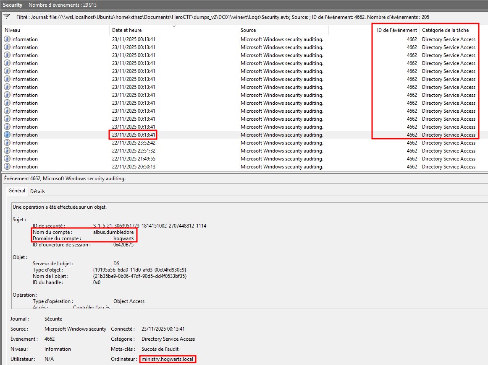
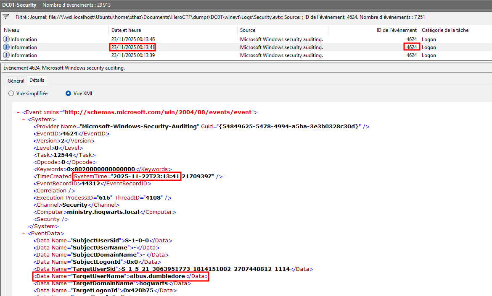
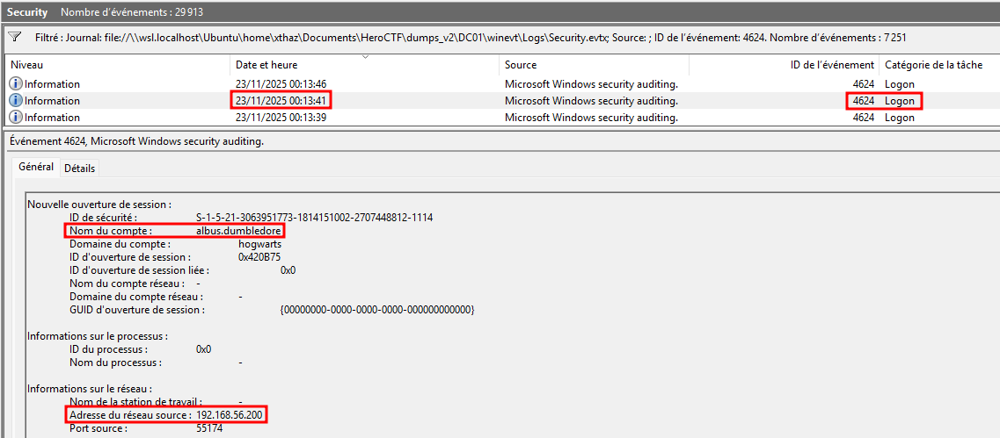
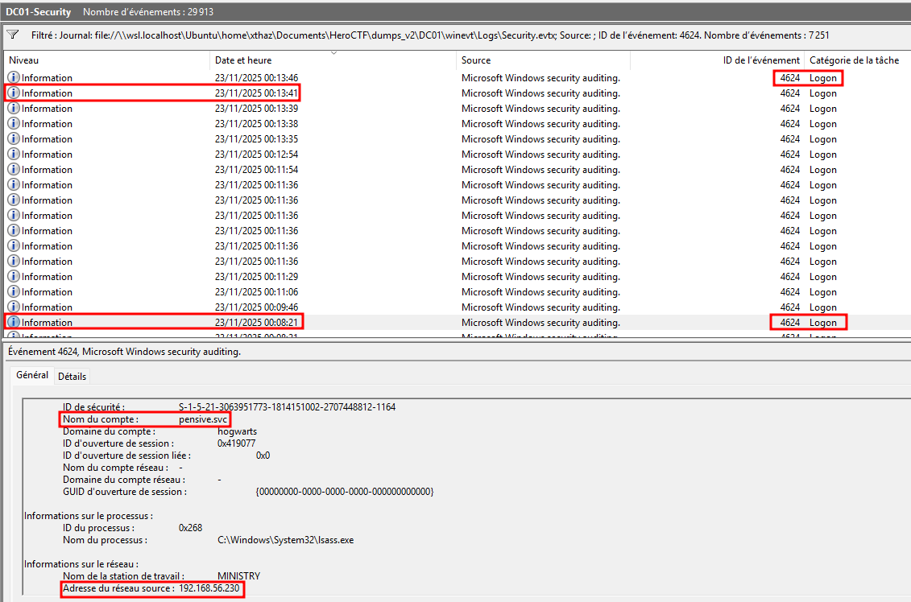

# Operation Pensieve Breach - 1

### Category

Forensics

### Difficulty

Easy

### Tags

- windows

### Author

xThaz

### Description

The SOC of the Ministry of Magic received multiple critical alerts from the Domain Controller.

Everything seems to be out of control.

It seems that a critical user has been compromised and is performing nasty magic using the DCsync spell.

You're mandated to investigate the Principal Domain Controller event logs to find:
- sAMAccountName (lowercase) of the compromised account performing bad stuff.
- Timestamp of the beginning of the attack, format: DD/MM/YYYY-11:22:33 SystemTime.
- Source IP address used for this attack.
- The last legitimate IP used to login before the attack.

The findings have to be separated by a ";".

- [ministry_winevt.7z](https://heroctf.fr-par-1.linodeobjects.com/ministry_winevt.7z)

Here is an example flag format:

`Hero{john.stark;DD/MM/YYYY-11:22:33;127.0.0.1;127.0.0.1}`

### Write Up

What every attacker dreams of when attacking Windows Active Directory is to compromise the Principal Domain Controller and the whole domain by exfiltrating the NTDS.dit file.
The easiest way to perform such a thing is to take advantage of the DSRUAPI method to act as a child domain controller and perform a domain synchronization (DCSync)

Such events can be natively logged inside the `Security.evtx` file.
More specifically, event ID `4662` which describes the AD object access.

On 22/11/2025 at 23:13:41, multiple events show that `albus.dumbledore` accessed a lot of objects
The screenshot shows 00:13:41 because there is a one hour difference between the audited system time and the local time. Detailed XML vue gives the requested `SystemTime`.

Converting the retrieved information to asked format gives `22/11/2025-23:13:41`.

From this information, correlation with other events has to be performed to find from which IP this attack comes.
Using event ID `4624` (Successful logon) it is possible to retrieve the source IP address.
IP source address: 192.168.56.200

Searching for the last legitimate IP address used by any account is just about looking for last login time before DCSync action without using `192.168.56.200`.

### Flag

Hero{albus.dumbledore;22/11/2025-23:13:41;192.168.56.200;192.168.56.230}