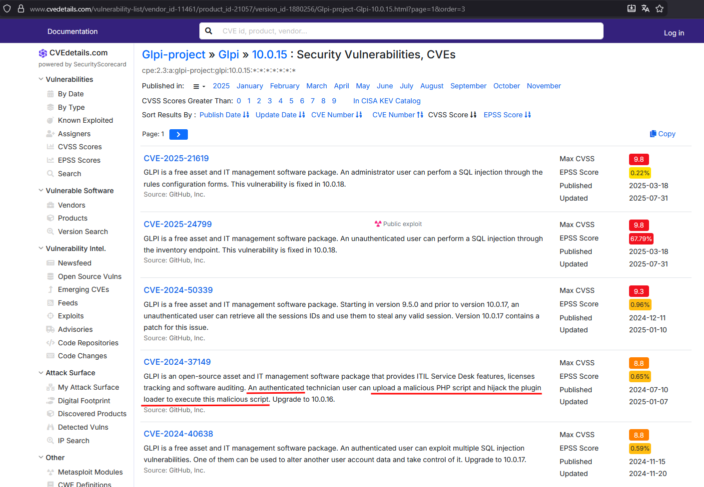

# Operation Pensieve Breach - 3

### Category

Forensics

### Difficulty

Medium

### Tags

- linux
- windows

### Author

xThaz

### Description

Now that you know how the attacker retrieved Albus' credentials, understand how the attacker managed to perform the previous actions.
Please find the following information about how he did this:
- Absolute path of the left-over file used to backdoor the authentication.
- Decoded identifier (without the flag wrapper) that the attacker encoded when registering the backdoor component.
- ID of the CVE used.
- sAMAccountName used to exploit the application.
- Using Ministry's log, what's the last **legitimate** IP address used by this user before exploitation? (192.168.56.1 is out of scope).

The findings have to be separated by a ";".

- [ministry_winevt.7z](https://heroctf.fr-par-1.linodeobjects.com/ministry_winevt.7z)
- [pensieve_var.7z](https://heroctf.fr-par-1.linodeobjects.com/pensieve_var.7z)

Here is an example flag format:

`Hero{/bin/bash;Decoded_IDENTIFIER_without_the_flag_wrapper;CVE-2025-12345;user.name;127.0.0.1}`

### Requirements

- "Operation Pensieve Breach - 1"
- "Operation Pensieve Breach - 2"

### Write Up

#### Absolute path of the file used to backdoor the authentication

The log file `/var/log/apache2/glpi_ssl_access.log` contains the requests made to the GLPI using SSL protocol.
A very simple quick win is to find out if there is any possible fingerprint through User-Agent.

```bash
$ awk -F\" '{print $(NF-1)}' var/log/apache2/glpi_ssl_access.log | sort -u

Mozilla/5.0 (Windows NT 10.0; Win64; x64; rv:145.0) Gecko/20100101 Firefox/145.0
curl/7.81.0
python-requests/2.32.5
```

The user-agents `curl` and `python-requests` are interesting.

```bash
$ grep -E "(curl|python)" var/log/apache2/glpi_ssl_access.log | grep POST

192.168.56.200 - - [22/Nov/2025:23:03:48 +0000] "POST /front/login.php HTTP/1.1" 302 469 "-" "python-requests/2.32.5"
192.168.56.200 - - [22/Nov/2025:23:03:48 +0000] "POST /front/helpdesk.public.php HTTP/1.1" 302 367 "-" "python-requests/2.32.5"
192.168.56.200 - - [22/Nov/2025:23:03:49 +0000] "POST /front/login.php HTTP/1.1" 302 469 "-" "python-requests/2.32.5"
192.168.56.200 - - [22/Nov/2025:23:03:49 +0000] "POST /front/helpdesk.public.php HTTP/1.1" 302 367 "-" "python-requests/2.32.5"
192.168.56.200 - - [22/Nov/2025:23:03:49 +0000] "POST /front/user.form.php HTTP/1.1" 302 349 "-" "python-requests/2.32.5"
192.168.56.200 - - [22/Nov/2025:23:03:49 +0000] "POST /ajax/fileupload.php?_method=DELETE&_uploader_picture%5B%5D=setup.php HTTP/1.1" 200 742 "-" "python-requests/2.32.5"
192.168.56.200 - - [22/Nov/2025:23:03:49 +0000] "POST /ajax/fileupload.php HTTP/1.1" 200 859 "-" "python-requests/2.32.5"
192.168.56.200 - - [22/Nov/2025:23:03:49 +0000] "POST /front/documenttype.form.php HTTP/1.1" 302 349 "-" "python-requests/2.32.5"
192.168.56.200 - - [22/Nov/2025:23:03:50 +0000] "POST /ajax/fileupload.php HTTP/1.1" 200 906 "-" "python-requests/2.32.5"
192.168.56.200 - - [22/Nov/2025:23:03:50 +0000] "POST /front/profile.form.php HTTP/1.1" 302 349 "-" "python-requests/2.32.5"
192.168.56.200 - - [22/Nov/2025:23:03:50 +0000] "POST /ajax/kanban.php HTTP/1.1" 200 334 "-" "python-requests/2.32.5"
192.168.56.200 - - [22/Nov/2025:23:03:50 +0000] "POST /ajax/search.php HTTP/1.1" 200 4380 "-" "python-requests/2.32.5"
192.168.56.200 - - [22/Nov/2025:23:03:50 +0000] "POST /front/profile.form.php HTTP/1.1" 302 349 "-" "python-requests/2.32.5"
```

A POST request was made to upload a file (`/ajax/fileupload.php`) probably named `setup.php`.
Is there a file that got that name on the filesystem?

```bash
$ find var/www/glpi -type f -name setup.php

var/www/glpi/files/_tmp/setup.php
```

Interesting, let's dig down.

```bash
$ head var/www/glpi/files/_tmp/setup.php

<?php

/****************************************************************
 * Webshell Usage:
 *   ?passwd=P@ssw0rd123 --> Print glpi passwords in use
 *   ?passwd=P@ssw0rd123&_hidden_cmd=whoami --> Execute whoami
 *
 * Used here exploits/utils/glpi_utils.py:method:get_glpi_shell
```

A webshell? Definitely on the right path.

#### Decoded name used by the attacker

As seen previously, the attacker used the file upload feature to upload a file named `setup.php` located at `/var/www/glpi/files/_tmp/`.
Then the attacker used this file as a plugin to backdoor the authentication.
The goal here is to understand how he managed to achieve code execution.
Analyzing the webshell code shows that multiple conditions are required before executing commands.

```php
if(isset($_GET["submit_form"]) && $_GET["submit_form"] === "2b01d9d592da55cca64dd7804bc295e6e03b5df4")
```

The GET parameter `submit_form` must have the value `2b01d9d592da55cca64dd7804bc295e6e03b5df4`.
Let's find the corresponding requests made to the server.

```bash
$ grep "submit_form" var/log/apache2/glpi_ssl_access.log

[...]
192.168.56.1 - - [22/Nov/2025:23:09:36 +0000] "GET /front/plugin.php?submit_form=2b01d9d592da55cca64dd7804bc295e6e03b5df4&save_result=oGAHt/Kk1OKeXWxy7iXUfw== HTTP/1.1" 200 12649 "-" "Mozilla/5.0 (Windows NT 10.0; Win64; x64; rv:145.0) Gecko/20100101 Firefox/145.0"
192.168.56.1 - - [22/Nov/2025:23:09:55 +0000] "GET /front/plugin.php?submit_form=2b01d9d592da55cca64dd7804bc295e6e03b5df4&save_result=oGAHt/Kk1OKeXWxy7iXUfw== HTTP/1.1" 200 12645 "-" "Mozilla/5.0 (Windows NT 10.0; Win64; x64; rv:145.0) Gecko/20100101 Firefox/145.0"
192.168.56.1 - - [22/Nov/2025:23:10:02 +0000] "GET /front/plugin.php?submit_form=2b01d9d592da55cca64dd7804bc295e6e03b5df4&save_result=4xRW8Us32tnzow8KiLOwuASwWypc4XE2LBDXaWQLmATmYOlVNcpYABK5gfF5xiwvLu1s6UpjuW2aJk94xSXQ1AaVGQFwdNpNR/7wqKV6JAE= HTTP/1.1" 200 28264 "-" "Mozilla/5.0 (Windows NT 10.0; Win64; x64; rv:145.0) Gecko/20100101 Firefox/145.0"
192.168.56.1 - - [22/Nov/2025:23:10:51 +0000] "GET /front/plugin.php?submit_form=2b01d9d592da55cca64dd7804bc295e6e03b5df4&save_result=86AyGErKuj5UoZE9eHtlIg== HTTP/1.1" 200 28168 "-" "Mozilla/5.0 (Windows NT 10.0; Win64; x64; rv:145.0) Gecko/20100101 Firefox/145.0"
```

This request was made to `/front/plugin.php`.
To find information about plugins, database access must be retrieved.
This can be done by building a MySQL server and replacing its data using the `/var/lib/mysql` directory.
But first, what's the database version?

```bash
$ cat var/lib/mysql/mysql_upgrade_info

10.11.14-MariaDB
```

Now create the docker configured with a volume that replaces the destination folder with the given extract.

```bash
$ docker run -it --rm \
  -v /home/user/dumps/GLPI01/var/lib/mysql:/var/lib/mysql \
  -e MYSQL_ALLOW_EMPTY_PASSWORD=yes \
  --name mariadb_recovery \
  mariadb:10.11 \
  --skip-grant-tables \
  --innodb_force_recovery=1
```

Finally connect to the docker and retrieve installed plugins on the system.

```bash
$ docker exec -it mariadb_recovery mysql
MariaDB [(none)]> show databases;
+--------------------+
| Database           |
+--------------------+
| information_schema |
| mysql              |
| pensieve           |
| performance_schema |
| sys                |
+--------------------+
MariaDB [(none)]> use pensieve;
MariaDB [pensieve]> select directory,name,author from glpi_plugins;

+-------------------------------------------------------------------------+-------------+--------------------------------------------------------------+
| directory                                                               | name        | author                                                       |
+-------------------------------------------------------------------------+-------------+--------------------------------------------------------------+
| ../../../../../../../../../../../../../../../../var/www/glpi/files/_tmp | form_submit | YUhlcm97VGhpc19HTFBJX2lzX2Z1bGx5X2JhY2tkb29yZWRfc2FwcmlzdGl9 |
+-------------------------------------------------------------------------+-------------+--------------------------------------------------------------+
```

This directory is very suspicious as it contains a path traversal.

```bash
$ echo "YUhlcm97VGhpc19HTFBJX2lzX2Z1bGx5X2JhY2tkb29yZWRfc2FwcmlzdGl9" | base64 -d

aHero{This_GLPI_is_fully_backdoored_sapristi}
```

#### CVE ID

This path traversal is not innocent.
Let's keep that in mind and collect other information before looking for the CVE ID.
There is a table `glpi_events` which lists the various major changes and actions made to the application.

```bash
MariaDB [pensieve]> SELECT * FROM glpi_events ORDER BY date DESC;
+----+----------+--------------+---------------------+---------+-------+------------------------------------------------------------------+
| id | items_id | type         | date                | service | level | message                                                          |
+----+----------+--------------+---------------------+---------+-------+------------------------------------------------------------------+
| 11 |        0 | system       | 2025-11-22 23:11:56 | login   |     3 | Connexion échouée de albus.dumbledore depuis l'IP 192.168.56.1   |
| 10 |        0 | system       | 2025-11-22 23:11:41 | login   |     3 | Connexion échouée de Flag depuis l'IP 192.168.56.1               |
|  9 |        0 | system       | 2025-11-22 23:09:16 | login   |     3 | neville.longbottom se connecte depuis l'IP 192.168.56.1          |
|  6 |       73 | DocumentType | 2025-11-22 23:03:50 | setup   |     4 | neville.longbottom adds the item PDF                             |
|  7 |        4 | profiles     | 2025-11-22 23:03:50 | setup   |     4 | neville.longbottom updates an item                               |
|  8 |        4 | profiles     | 2025-11-22 23:03:50 | setup   |     4 | neville.longbottom updates an item                               |
|  5 |        0 | system       | 2025-11-22 23:03:49 | login   |     3 | neville.longbottom log in from IP 192.168.56.200                 |
|  4 |        0 | system       | 2025-11-22 23:03:48 | login   |     3 | neville.longbottom log in from IP 192.168.56.200                 |
|  3 |        0 | system       | 2025-11-22 21:48:01 | login   |     3 | neville.longbottom se connecte depuis l'IP 192.168.56.1          |
|  2 |        8 | users        | 2025-11-22 21:47:42 | setup   |     4 | glpi adds a user to an entity                                    |
|  1 |        0 | system       | 2025-11-22 21:44:22 | login   |     3 | glpi se connecte depuis l'IP 192.168.56.1                        |
+----+----------+--------------+---------------------+---------+-------+------------------------------------------------------------------+
```

User `neville.longbottom` added a DocumentType PDF.
Let's compile what we know so far:
- Authenticated access was used.
- A PHP webshell was uploaded.
- Document type PDF was added.
- Plugin was used to execute the webshell.
- This plugin was loaded using a path traversal.
It's time to do some research.
First, retrieve CVE information about this application's exact version to identify the existing vulnerabilities and order them by score severity.



The fourth description looks promising.

At this step `CVE-2024-37149` can just be tried by players.

BUT, here are some reading suggestions about the vulnerability:
- Blogpost about vulnerability discovery: https://sensepost.com/blog/2024/from-a-glpi-patch-bypass-to-rce/
- PoC: https://github.com/Orange-Cyberdefense/glpwnme/blob/main/glpwnme/exploits/implementations/cve_2024_37149.py

The blogpost and source code of the exploit confirm the endpoints and payloads used by the attacker.

#### sAMAccountName used to exploit the application

To find what user exploited this vulnerability, let's filter authentications made using a python script.

```bash
$ grep -E "(curl|python)" var/log/apache2/glpi_ssl_access.log | grep '/front/login.php'

192.168.56.200 - - [22/Nov/2025:23:03:48 +0000] "POST /front/login.php HTTP/1.1" 302 469 "-" "python-requests/2.32.5"
192.168.56.200 - - [22/Nov/2025:23:03:49 +0000] "POST /front/login.php HTTP/1.1" 302 469 "-" "python-requests/2.32.5"
```

A user successfully authenticated, because the application returned a 302 redirect HTTP code to `helpdesk.public.php` on 22nd November 2025 at 23:03:48.
Using this timestamp, inspect `/var/www/glpi/files/_log/event.log` to identify usernames that authenticated.

```bash
$ cat var/www/glpi/files/_log/event.log

[...]
2025-11-22 23:03:48 [@pensieve01]
[login] 3: neville.longbottom log in from IP 192.168.56.200
2025-11-22 23:03:49 [@pensieve01]
[login] 3: neville.longbottom log in from IP 192.168.56.200
[...]
```

It reveals this is `neville.longbottom`.

#### Last legitimate IP address used by this user

Using this snippet of code, the event logs can be parsed in order to get from where the user logged on. This script is based on the `python-evtx` library.

```python
#!/usr/bin/env python3
from Evtx.Evtx import Evtx
from lxml import etree
import argparse

NS = {"ns": "http://schemas.microsoft.com/win/2004/08/events/event"}

def parse_evtx_file(filepath, user_filter=None):
    results = []

    with Evtx(filepath) as log:
        for record in log.records():
            xml = record.xml()
            root = etree.fromstring(xml.encode())

            # EventID = 4624
            event_id = root.xpath("string(ns:System/ns:EventID)", namespaces=NS)
            if event_id != "4624":
                continue

            timestamp = root.xpath("string(ns:System/ns:TimeCreated/@SystemTime)", namespaces=NS)
            username  = root.xpath("string(ns:EventData/ns:Data[@Name='TargetUserName'])", namespaces=NS)
            ip        = root.xpath("string(ns:EventData/ns:Data[@Name='IpAddress'])", namespaces=NS)

            if user_filter and username.lower() != user_filter.lower():
                continue

            results.append({
                "timestamp": timestamp,
                "username": username,
                "ip": ip,
            })

    return results
```

```bash
$ python3 dump_logons.py -f Security.evtx > successful_logons.txt
$ grep 'neville.longbottom' successful_logons.txt

2025-11-22 23:08:21.123816 | neville.longbottom | 192.168.56.230
2025-11-22 23:03:46.378359 | neville.longbottom | 192.168.56.230
2025-11-22 23:03:45.717628 | neville.longbottom | 192.168.56.230
2025-11-22 23:01:39.770769 | neville.longbottom | 192.168.56.200
2025-11-22 22:52:23.824984 | neville.longbottom | 192.168.56.1
2025-11-22 22:52:23.824310 | neville.longbottom | 192.168.56.1
2025-11-22 22:52:23.819744 | neville.longbottom | 192.168.56.1
2025-11-22 22:52:23.819475 | neville.longbottom | 192.168.56.1
2025-11-22 22:52:23.796780 | neville.longbottom | 192.168.56.101
2025-11-22 22:52:23.795660 | neville.longbottom | 192.168.56.101
2025-11-22 22:52:23.795528 | neville.longbottom | 192.168.56.101
2025-11-22 22:52:23.785868 | neville.longbottom | -
2025-11-22 22:52:23.781559 | neville.longbottom | 192.168.56.101
2025-11-22 22:52:23.241056 | neville.longbottom | 192.168.56.101
2025-11-22 22:52:22.738871 | neville.longbottom | 192.168.56.101
2025-11-22 22:52:22.717611 | neville.longbottom | 192.168.56.101
2025-11-22 21:47:48.503229 | neville.longbottom | 192.168.56.230
```

Since `192.168.56.1` is out of scope, the most used IP address is `192.168.56.101`.

### Flag

Hero{/var/www/glpi/files/_tmp/setup.php;This_GLPI_is_fully_backdoored_sapristi;CVE-2024-37149;neville.longbottom;192.168.56.101}