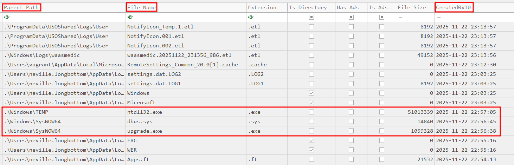
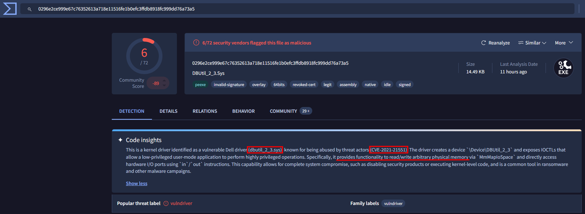
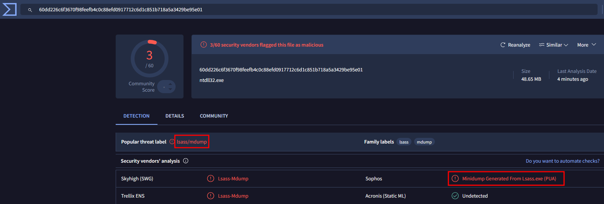
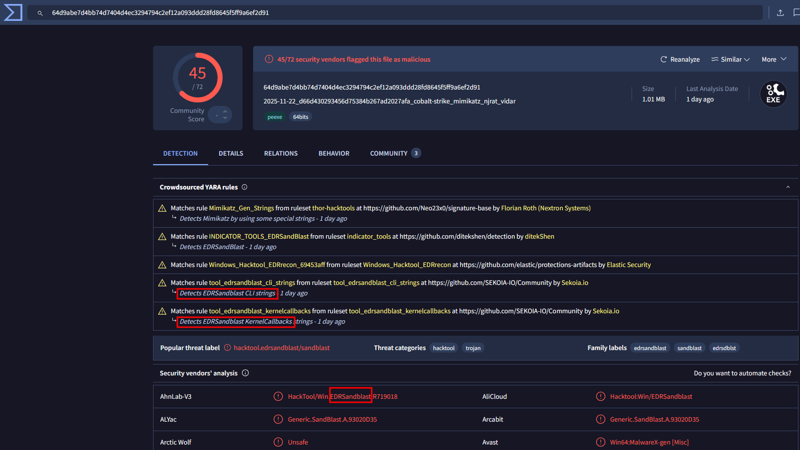

# Operation Pensieve Breach - 4

### Category

Forensics

### Difficulty

Easy

### Tags

- windows

### Author

xThaz

### Description

As you've seen previously, the pensive (GLPI) got compromised.
Neville got his account compromised too.
Last time he logged on legitimately was on `gringotts01.hogwarts.local` (192.168.56.101).
Investigate the server to find how his credentials were stolen.
Please find the following information about how this was done:
- Absolute path of the vulnerable binary.
- Absolute path of the file containing Neville's credentials.
- Absolute path of the file used to exploit the vulnerable binary.

The findings have to be separated by a ";".
Paths have to be in lowercase.

- [gringotts01-artifacts.7z](https://heroctf.fr-par-1.linodeobjects.com/gringotts01-artifacts.7z)

Here is an example flag format:

`Hero{c:\path\file.ext;c:\path\file.ext;c:\path\file.ext}`

### Requirements

- "Operation Pensieve Breach - 1"
- "Operation Pensieve Breach - 2"
- "Operation Pensieve Breach - 3"

### Write Up

#### Vulnerable binary

A very powerful way to understand what happened in Windows environments is to reconstruct a timeline of events.
To perform such a thing, `$MFT` can be used.
It contains all the modifications made over the filesystem.
[Eric Zimmerman's tools suite](https://ericzimmerman.github.io/#!index.md) can be used as it contains a tool named `MFTECmd`.

```bash
.\MFTECmd.exe -f 'SQL01/artifacts/$MFT' --csv SQL01 --csvf SQL01-mft-timeline.csv
```

The tool created an output file in CSV format.
Another Zimmerman tool can be used to parse the generated timeline : `Timeline Explorer`.
From the previous challenge, we know that Neville legitimately connected to that server between 23h00 and 23h21.
By sorting the timestamps of created files, the first abnormal files are:
- C:\Windows\TEMP\ntdll32.exe: Definitely nothing to do in temp files.
- C:\Windows\SysWOW64\dbus.sys: Sys extension is used by drivers. Created almost at the same time.
- C:\Windows\SysWOW64\upgrade.exe: Created almost at the same time.



Using the given hash list file, let's retrieve the files' hashes.

```bash
$ grep -E '(ntdll32.exe|\\dbus.sys|upgrade.exe)' SQL01/gringotts01-hash_list.csv

"c16c588eaf334f2cc658ee3aa36c1d8f","2ba4f4058882098a4604c27f342877b1e0e96943","sql01.vmdk\Partition 2 [40608MB]\Windows 2019 [NTFS]\[root]\Windows\TEMP\ntdll32.exe"
"c996d7971c49252c582171d9380360f2","c948ae14761095e4d76b55d9de86412258be7afd","sql01.vmdk\Partition 2 [40608MB]\Windows 2019 [NTFS]\[root]\Windows\SysWOW64\dbus.sys"
"d66d430293456d75384b267ad2027afa","97e4a0e5c6cc99a17e0a3cbea5a18cce51484bee","sql01.vmdk\Partition 2 [40608MB]\Windows 2019 [NTFS]\[root]\Windows\SysWOW64\upgrade.exe"
```

By searching the driver's hash on VirusTotal, it shows that it appears to be a vulnerable driver that can dump physical memory.



#### Neville's credentials file

The process responsible for windows authentication is `lsass.exe` when a user is interactively connected, this process will contain his connection information (ie. his NT Hash, based on his cleartext password).
Looking at the `ntdll32.exe` file on VirusTotal shows that it may be a minidump of LSASS process containing credentials.



#### Exploitation of the vulnerable driver

Now that the vulnerable driver is identified and it confirms that LSASS memory was dumped.
A last question remains: how did the attacker exploit this driver.



It's [EDRSandblast](https://github.com/wavestone-cdt/EDRSandblast) a tool designed to exploit vulnerable drivers and bypass defenses to dump LSASS process memory.

### Flag

Hero{c:\windows\syswow64\dbus.sys;c:\windows\temp\ntdll32.exe;c:\windows\syswow64\upgrade.exe}