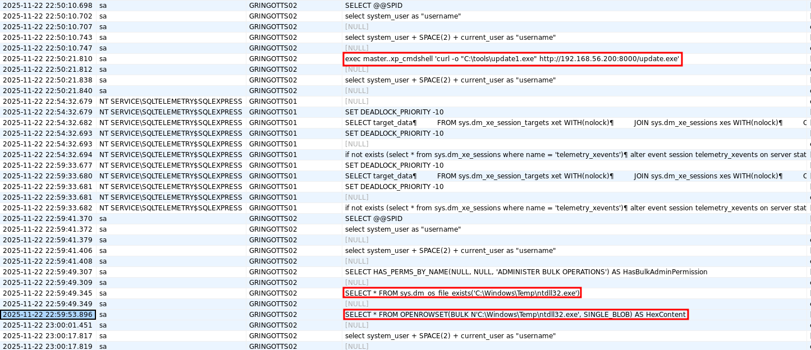
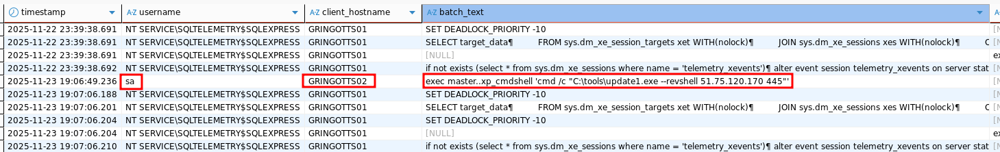
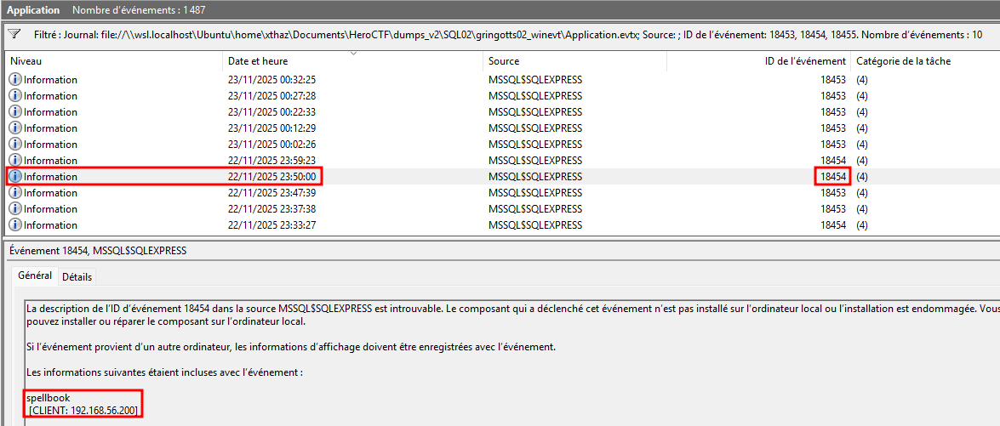

# Operation Pensieve Breach - 5

### Category

Forensics

### Difficulty

Medium

### Tags

- windows

### Author

xThaz

### Description

You understand how the attacker might have retrieved Neville's credentials.
But how did the attacker gain administrative access over `gringotts01.hogwarts.local` ?
Find the following information:
- Account used to download and execute payloads.
- NETBIOS name of the machine from which the requests are issued.
- URL used to host the reverse shell executable.
- Port used by the attacker for his reverse shell.
- Internal IP address from which SQL queries are actually issued.

The findings have to be separated by a ";".

- [gringotts01-sqllogs.7z](https://heroctf.fr-par-1.linodeobjects.com/gringotts01-sqllogs.7z)
- [gringotts01_winevt.7z](https://heroctf.fr-par-1.linodeobjects.com/gringotts01_winevt.7z)
- [gringotts02_winevt.7z](https://heroctf.fr-par-1.linodeobjects.com/gringotts02_winevt.7z)

Here is an example flag format:

`Hero{account;MACHINE23;ftp://attacker.com:21/file.ext;445;127.0.0.1}`

### Requirements

- "Operation Pensieve Breach - 1"
- "Operation Pensieve Breach - 2"
- "Operation Pensieve Breach - 3"
- "Operation Pensieve Breach - 4"

### Write Up

#### How to use XEL logs ?

XEL is a format used by SSMS to save extended events. This kind of file can be ingested inside databases to audit logs. Such a thing can be achieved using MSSQL docker.

```bash
$ docker run -d --name sql \
  -e "ACCEPT_EULA=Y" \
  -e 'SA_PASSWORD=Password123!' \
  -p 1433:1433 \
  mcr.microsoft.com/mssql/server:2022-latest
```

Transfer the audit file to the docker.

```bash
$ docker cp sqllogs_0_134083199634230000_2s.xel sql:/tmp/trace.xel
```

Now that the database is ready to be used, any database client that supports SQL Server can be used. Here I used DBeaver which supports tons of database schema. The following script can be used to ingest trace data into the database.

```sql
SET QUOTED_IDENTIFIER ON;

IF OBJECT_ID('dbo.XEL_Trace') IS NOT NULL
    DROP VIEW dbo.XEL_Trace;
GO

CREATE VIEW dbo.XEL_Trace AS
WITH x AS (
    SELECT CAST(event_data AS XML) AS x
    FROM sys.fn_xe_file_target_read_file('/tmp/trace.xel', NULL, NULL, NULL)
)
SELECT
    x.value('(event/@timestamp)[1]', 'datetime2')                                AS [timestamp],
    x.value('(event/action[@name="username"]/value)[1]', 'nvarchar(256)')        AS [username],
    x.value('(event/action[@name="client_hostname"]/value)[1]', 'nvarchar(256)') AS [client_hostname],
    x.value('(event/data[@name="batch_text"]/value)[1]', 'nvarchar(max)')        AS [batch_text],
    x.value('(event/data[@name="statement"]/value)[1]', 'nvarchar(max)')         AS [statement],
    x.value('(event/@name)[1]', 'nvarchar(100)')                                  AS event_name
FROM x;
GO
```

Finally, requesting the newly created view reveals all the SQL commands executed on `gringotts01`.

```sql
SELECT * FROM dbo.XEL_Trace ORDER BY [timestamp];
```

#### Basic information about what was executed

As seen inside the `$MFT` timeline, the executables used to dump `LSASS` process memory were dropped at the following timestamp:
- `upgrade.exe` (EDRSandblast, exploit for vulnerable drivers): 2025-11-22 22:56:38
- `dbus.sys` (dbutil_2_3.sys, vulnerable driver): 2025-11-22 22:56:45
- `ntdll32.exe` (LSASS memory dump): 2025-11-22 22:57:05

Using those timestamps, several actions can be retrieved from the SQL transaction logs.



These logs show:
- Downloaded an unknown executable.
- Retrieved the LSASS memory dump.

These requests were made using local `sa` account from the database hosted on `GRINGOTTS02`.



Later, it shows that the unknown executable was used to execute a reverse shell to `51.75.120.170` on port `445`.

#### Internal machine actually issuing SQL requests

As we now know, the SQL requests are made via `GRINGOTTS02`. To identify what is the actual IP address that is performing the requests, authentication logs for `sa` account of `GRINGOTTS02` have to be reviewed.

Based on [this article](https://cybersecthreat.com/2020/07/08/enable-mssql-authentication-log-to-eventlog/), when enabled, authentication logs are stored inside `Application.evtx` event logs. Inside these logs, event IDs 18453, 18454 and 18455 represent successful logon.



### Flag

Hero{sa;GRINGOTTS02;http://192.168.56.200:8000/update.exe;445;192.168.56.200}