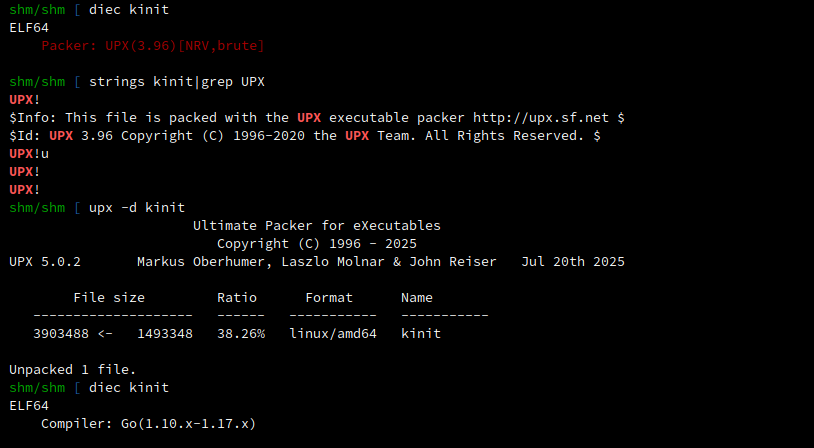
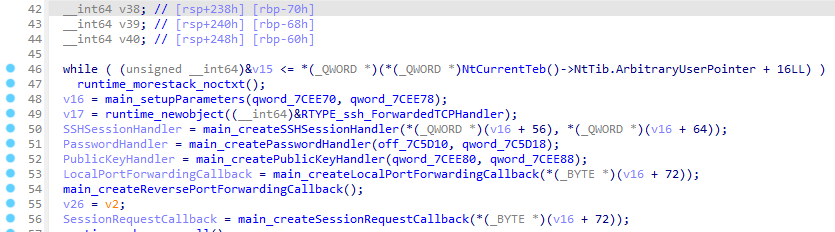
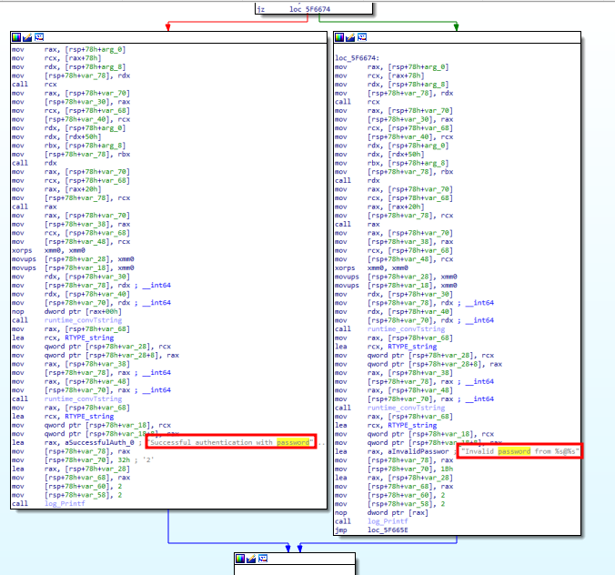
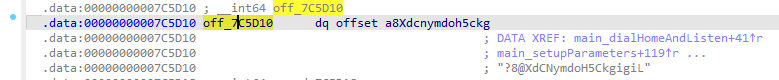
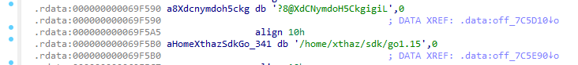

# Operation Pensieve Breach - 7

### Category

Forensics

### Difficulty

Hard

### Tags

- linux

### Author

xThaz

### Description

You understood every exploitation step of the attacker.
It's time to perform a final analysis and find what infrastructure the attacker used for the pensieve breach.

Please find the following information about how the attacker compromised the server:
- PID of the implant running.
- IP address of the attacking server where all the attack took place.
- Port used by the attacker for his implant callback.
- Secret used by the attacker to connect to the implant.
- Local username of the attacker on his attacking machine.

The findings have to be separated by a ";".

- [spellbook_ram.7z](https://heroctf.fr-par-1.linodeobjects.com/spellbook_ram.7z)
- [spellbook_shm.7z](https://heroctf.fr-par-1.linodeobjects.com/spellbook_shm.7z)

Here is an example flag format:

`Hero{1000;127.0.0.1;123;TheSecret!Used?;username}`

### Requirements

- "Operation Pensieve Breach - 1"
- "Operation Pensieve Breach - 2"
- "Operation Pensieve Breach - 3"
- "Operation Pensieve Breach - 4"
- "Operation Pensieve Breach - 5"
- "Operation Pensieve Breach - 6"

### Write Up

#### Getting symbols info for volatility 3

In order to build the volatility 3 symbols, the kernel version installed on the targeted machine must be retrieved.
The Banners plugin of volatility 3 can be used.

```bash
$ pipx install volatility3
$ vol -f kcore.dumpit.6.1.0-41-amd64.2025-11-13-0037.core banners.Banners

0x18a00da0      Linux version 6.1.0-41-amd64 (debian-kernel@lists.debian.org) (gcc-12 (Debian 12.2.0-14+deb12u1) 12.2.0, GNU ld (GNU Binutils for Debian) 2.40) # SMP PREEMPT_DYNAMIC Debian 6.1.158-1 (2025-11-09)
0x18b61940      Linux version 6.1.0-41-amd64 (debian-kernel@lists.debian.org) (gcc-12 (Debian 12.2.0-14+deb12u1) 12.2.0, GNU ld (GNU Binutils for Debian) 2.40) #1 SMP PREEMPT_DYNAMIC Debian 6.1.158-1 (2025-11-09)
0x1a9856e0      Linux version 6.1.0-41-amd64 (debian-kernel@lists.debian.org) (gcc-12 (Debian 12.2.0-14+deb12u1) 12.2.0, GNU ld (GNU Binutils for Debian) 2.40) #1 SMP PREEMPT_DYNAMIC Debian 6.1.158-1 (2025-11-09)
```

Now install the exact same kernel version on a machine.

```bash
$ sudo su
$ echo "deb http://deb.debian.org/debian-debug/ bookworm-debug main" | tee -a /etc/apt/sources.list.d/debug.list
$ echo "deb http://deb.debian.org/debian-debug/ bookworm-proposed-updates-debug main" | tee -a /etc/apt/sources.list.d/debug.list
$ apt update -y
$ apt install -y linux-image-6.1.0-41-amd64-dbg
```

Copy the kernel debug build.

```bash
$ scp -i private_key -o StrictHostKeyChecking=no vagrant@192.168.1.35:/usr/lib/debug/boot/vmlinux-6.1.0-41-amd64 vmlinux-6.1.0-41-amd64
```

In order to use `dwarf2json`, `go` must be installed.

```bash
$ curl -L https://go.dev/dl/go1.25.4.linux-amd64.tar.gz --output go1.25.4.linux-amd64.tar.gz
$ tar -C /usr/local -xzf go1.25.4.linux-amd64.tar.gz
$ export PATH=$PATH:/usr/local/go/bin
$ rm go1.25.4.linux-amd64.tar.gz
```

Then build `dwarf2json` binary and create volatility 3 symbols from the kernel debug build.

```bash
$ git clone https://github.com/volatilityfoundation/dwarf2json
$ cd dwarf2json
$ go build
$ ./dwarf2json linux --elf vmlinux-6.1.0-41-amd64 > vmlinux-6.1.0-41-amd64.json
```

#### Analyse

##### PID

PsTree can be used to retrieve the process list with associated PID.

```bash
$ vol -f web01_ram.dump -s linux linux.pstree

OFFSET (V)                 PID     TID     PPID    COMM
** 0x8e73c126e100          22951   22951   454     sshd
*** 0x8e73c5cb48c0         22958   22958   22951   sshd
**** 0x8e73c5cb6100        22959   22959   22958   bash
***** 0x8e73c5cb0000       23029   23029   22959   sudo
****** 0x8e73c5cb1840      23030   23030   23029   sudo
******* 0x8e73ca783080     23031   23031   23030   su
******** 0x8e73ca780000    23032   23032   23031   bash
********* 0x8e73ca79c8c0   23033   23033   23032   kinit
```

Answer is `23033`.

##### IP address and port

Sockstat will return the needed information.

```bash
$ vol -f web01_ram.dump -s linux linux.sockstat --pids 23033

NetNS        Process Name   PID     Sock Offset     Family  Type    Proto   Source Addr     Source Port   Destination Addr    Destination Port   State
4026531840   kinit          23033   0x8e73c31a9b00  AF_INET STREAM  TCP     10.0.2.15       50964         51.75.120.170       53                 ESTABLISHED
4026531840   kinit          23033   0x8e73c31ac800  AF_INET STREAM  TCP     192.168.56.200  54124         192.168.56.102      1433               ESTABLISHED
4026531840   kinit          23033   0x8e73c31a9b00  AF_INET STREAM  TCP     10.0.2.15       50964         51.75.120.170       53                 ESTABLISHED
4026531840   kinit          23033   0x8e73c31ac800  AF_INET STREAM  TCP     192.168.56.200  54124         192.168.56.102      1433               ESTABLISHED
4026531840   kinit          23033   0x8e73c31a9b00  AF_INET STREAM  TCP     10.0.2.15       50964         51.75.120.170       53                 ESTABLISHED
4026531840   kinit          23033   0x8e73c31ac800  AF_INET STREAM  TCP     192.168.56.200  54124         192.168.56.102      1433               ESTABLISHED
4026531840   kinit          23033   0x8e73c31a9b00  AF_INET STREAM  TCP     10.0.2.15       50964         51.75.120.170       53                 ESTABLISHED
4026531840   kinit          23033   0x8e73c31ac800  AF_INET STREAM  TCP     192.168.56.200  54124         192.168.56.102      1433               ESTABLISHED
```

Answer is `51.75.120.170:53`.

##### Passphrase & Username

###### Easy way

The easiest way to get the passphrase is to run strings on the binary, but you'll need to identify which random string corresponds to the passphrase.

```bash
$ strings kinit -n 20

Usage: %[1]s [options] [[<user>@]<target>]
        %[1]s -v -l -p 4444
        %[1]s kali@192.168.0.1
        %[1]s -p 31337 192.168.0.1
        %[1]s -v -b 0 kali@192.168.0.2
        -l, Start reverseSSH in listening mode (overrides reverse scenario)
        -p, Port at which reverseSSH is listening for incoming ssh connections (bind scenario)
                or where it tries to establish a ssh connection (reverse scenario) (default: %[6]s)
        -b, Reverse scenario only: bind to this port after dialling home (default: %[7]s)
        -s, Shell to spawn for incoming connections, e.g. /bin/bash; (default: %[5]s)
                for windows this can only be used to give a path to 'ssh-shellhost.exe' to
                enhance pre-Windows10 shells (e.g. '-s ssh-shellhost.exe' if in same directory)
        -N, Deny all incoming shell/exec/subsystem and local port forwarding requests
                (if only remote port forwarding is needed, e.g. when catching reverse connections)
        -v, Emit log output
        Optional target which enables the reverse scenario. Can be prepended with
        <user>@ to authenticate as a different user other than '%[8]s' while dialling home
        Accepting all incoming connections from any user with either of the following:
         * Password "%[3]s"
         * PubKey   "%[4]s"
 "%&()*,-24569:=ABEHIJQUXZ\_bcex
call frame too large
?8@XdCNymdoH5CkgigiL
/home/xthaz/sdk/go1.15
```

There are also some debug strings used to compile the binary, including the homedirectory name.

Passphrase: `?8@XdCNymdoH5CkgigiL`
Pseudo: `xthaz`

###### The safest way

The hardest way to identify the passphrase used to connect to the SSH service is by reversing the binary. First of all, what is that binary? Its seems to be packed with UPX, which is public. To analyse this binary, just unpack it using `upx` command.



Open the given binary in a decompiler. For instance, we'll use IDA. Then go into the main function named `main.main`.


Inside the main, there are plenty of functions about SSH.



Then it is refering to a function named `main_createPasswordHandler()` that returns a `Passwordhandler`. This password handler function compares a given string to something. If this strings is correct it returns an SSH session.



Since it compares a strings with another and returns an SSH session, we can assume that it compares user's given passphrase with the correct one. To find what passphrase is used to succesfully authentication a user, we'll dig into functions parameters. As it is shown, there is a pointer stored in the section `data`.



This pointer then refers to a strings which is the passphrase stored inside the section `rdata`.



Inside the section there is the SSH passphrase along with the absolute path of the golang binary used by the attacker to compile the binary.

### Flag

Hero{23033;51.75.120.170;53;?8@XdCNymdoH5CkgigiL;xthaz}