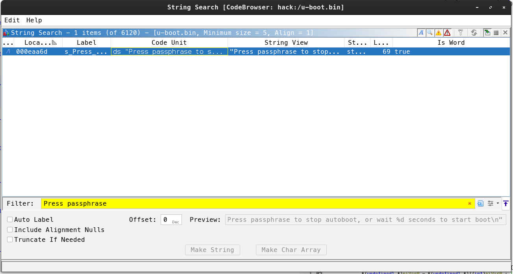
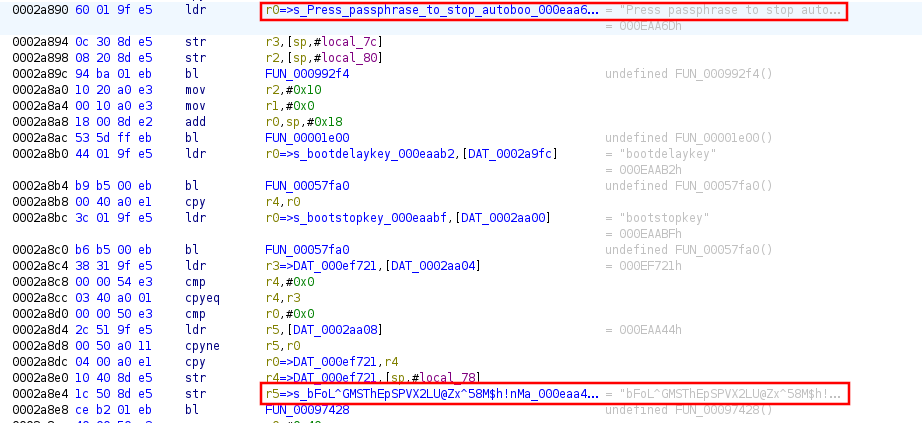

# Bootloader

### Category

Misc

### Difficulty

Medium

### Author

Thib

### Description

It's just a bootloader. Try to find the flag!

Architecture : ARMv7 32bits little-endian
Encryption used : AES-128 ECB

Deploy an instance at https://deploy.heroctf.fr/.

### Files

- [u-boot.bin](u-boot.bin)

### Write up

The first step is to launch the challenge and listen on the specified port: 

```bash
$ nc localhost 4000     
Press ENTER to start boot
```

It looks like we can start a boot procedure, which makes sense given the name of the challenge. So let's press ENTER.

```
Bloblist at 0 not found (err=-2)
alloc space exhausted ptr 400 limit 0
Bloblist at 0 not found (err=-2)


U-Boot 2026.01-rc2-00041-g69cc92d6869b-dirty (Nov 15 2025 - 17:13:43 +0100)

DRAM:  128 MiB
using memory 0x4668d000-0x476cd000 for malloc()
Core:  51 devices, 14 uclasses, devicetree: board
Flash: 64 MiB
Loading Environment from Flash... *** Warning - bad CRC, using default environment

In:    serial,usbkbd
Out:   serial,vidconsole
Err:   serial,vidconsole
No USB controllers found
Net:   eth0: virtio-net#32

Press passphrase to stop autoboot, or wait 5 seconds to start boot
```

At the end of the boot, we can see an encrypted flag : 

```
## Starting application at 0x40200000 ...
Boot completed, here is your encrypted flag : CE04188B3AA1F39921E5ABBCB0BD7531BB723B6ECA66C3FEDCA81C587E8588350C1035DA0D1C58E6868FE8E46CFC7551
```

It is a bootloader based on U-Boot and seems to require a passphrase to stop booting and access the UBoot console.

But how can we find this passphrase? Luckily, the bootloader binary is provided with the challenge, so we can try to reverse engineer it.

There are two ways to do this: 

- Dirty way :

```
$ strings u-boot.bin | grep -A 5 -B 5 "passphrase"
kernel-offset
kernaddr
rootdisk-offset
rootaddr
bFoL^GMSThEpSPVX2LU@Zx^58M$h!nMaoRBzu7Wa
Press passphrase to stop autoboot, or wait %d seconds to start boot
bootdelaykey
bootstopkey
fdtdec_setup
%s(): initcall %s() failed
initf_malloc
```

- Clean way (As indicated in the instructions, it is ARMv7 32-bit little-endian.) : 

We search the string : 


- We look at the strange character strings around the occurrence.


So we can see that the passphrase is “bFoL^GMSThEpSPVX2LU@Zx^58M$h!nMaoRBzu7Wa”

You can therefore stop the boot process and access the UBoot console.

```
Press passphrase to stop autoboot, or wait 5 seconds to start boot
bFoL^GMSThEpSPVX2LU@Zx^58M$h!nMaoRBzu7Wa
=> help
help
?         - alias for 'help'
base      - print or set address offset
bdinfo    - print Board Info structure
blkcache  - block cache diagnostics and control
bloblist  - Bloblists
boot      - boot default, i.e., run 'bootcmd'
bootd     - boot default, i.e., run 'bootcmd'
bootdev   - Boot devices
bootefi   - Boots an EFI payload from memory
bootelf   - Boot from an ELF image in memory
bootflow  - Boot flows
bootm     - boot application image from memory
bootmeth  - Boot methods
bootp     - boot image via network using BOOTP/TFTP protocol
bootstd   - Standard-boot operation
bootvx    - Boot vxWorks from an ELF image
bootz     - boot Linux zImage image from memory
chpart    - change active partition of a MTD device
cls       - clear screen
cmp       - memory compare
coninfo   - print console devices and information
cp        - memory copy
crc32     - checksum calculation
cyclic    - Cyclic
date      - get/set/reset date & time
dfu       - Device Firmware Upgrade
dhcp      - boot image via network using DHCP/TFTP protocol
dm        - Driver model low level access
echo      - echo args to console
editenv   - edit environment variable
eficonfig - provide menu-driven UEFI variable maintenance interface
env       - environment handling commands
erase     - erase FLASH memory
exit      - exit script
ext2load  - load binary file from a Ext2 filesystem
ext2ls    - list files in a directory (default /)
ext4load  - load binary file from a Ext4 filesystem
ext4ls    - list files in a directory (default /)
ext4size  - determine a file's size
false     - do nothing, unsuccessfully
fatinfo   - print information about filesystem
fatload   - load binary file from a dos filesystem
fatls     - list files in a directory (default /)
fatmkdir  - create a directory
fatrm     - delete a file
fatsize   - determine a file's size
fatwrite  - write file into a dos filesystem
fdt       - flattened device tree utility commands
flinfo    - print FLASH memory information
fstype    - Look up a filesystem type
fstypes   - List supported filesystem types
go        - start application at address 'addr'
help      - print command description/usage
iminfo    - print header information for application image
imxtract  - extract a part of a multi-image
itest     - return true/false on integer compare
lcdputs   - print string on video framebuffer
ln        - Create a symbolic link
load      - load binary file from a filesystem
loadb     - load binary file over serial line (kermit mode)
loads     - load S-Record file over serial line
loadx     - load binary file over serial line (xmodem mode)
loady     - load binary file over serial line (ymodem mode)
loop      - infinite loop on address range
ls        - list files in a directory (default /)
md        - memory display
mii       - MII utility commands
mkdir     - create a directory
mm        - memory modify (auto-incrementing address)
mtd       - MTD utils
mtdparts  - define flash/nand partitions
mv        - rename/move a file/directory
mw        - memory write (fill)
net       - NET sub-system
nm        - memory modify (constant address)
nvme      - NVM Express sub-system
panic     - Panic with optional message
part      - disk partition related commands
pci       - list and access PCI Configuration Space
ping      - send ICMP ECHO_REQUEST to network host
poweroff  - Perform POWEROFF of the device
printenv  - print environment variables
protect   - enable or disable FLASH write protection
pxe       - get and boot from pxe files
qfw       - QEMU firmware interface
random    - fill memory with random pattern
reset     - Perform RESET of the CPU
rm        - delete a file
run       - run commands in an environment variable
save      - save file to a filesystem
saveenv   - save environment variables to persistent storage
scsi      - SCSI sub-system
scsiboot  - boot from SCSI device
setcurs   - set cursor position within screen
setenv    - set environment variables
setexpr   - set environment variable as the result of eval expression
showvar   - print local hushshell variables
size      - determine a file's size
sleep     - delay execution for some time
source    - run script from memory
spawn     - run commands and summarize execution time
test      - minimal test like /bin/sh
tftpboot  - load file via network using TFTP protocol
tpm       - Issue a TPMv1.x command
tpm2      - Issue a TPMv2.x command
true      - do nothing, successfully
usb       - USB sub-system
usbboot   - boot from USB device
ut        - unit tests
vbe       - Verified Boot for Embedded
version   - print monitor, compiler and linker version
virtio    - virtio block devices sub-system
wait      - wait for one or more jobs to complete
wget      - boot image via network using HTTP protocol
=> 
```

The goal here is to dump the firmware from memory to attempt to reverse engineer it locally and recover the flag.

How can we dump part of the memory? There are several ways to do this, but since we are on a remote interface via netcat, there are few ways to do it. Looking at the UBoot documentation, we come across the md command.


To find the start address of the firmware and its size, it's quite simple: just do a `printenv` and look at the `bootcmd` variable, which corresponds to the command that will be executed at boot time.

```
=> printenv
printenv
arch=arm
baudrate=115200
board=qemu-arm
board_name=qemu-arm
boot_targets=qfw usb scsi virtio nvme dhcp
bootcmd=go 0x40200000
bootdelay=5
cpu=armv7
ethaddr=52:54:00:12:34:56
fdt_addr=0x40000000
fdt_high=0xffffffff
fdtcontroladdr=4658ceb0
fwaddr=0x40200000
fwsize=0x00000B30
initrd_high=0xffffffff
kernel_addr_r=0x40400000
loadaddr=0x40200000
preboot=usb start
pxefile_addr_r=0x40300000
ramdisk_addr_r=0x44000000
scriptaddr=0x40200000
stderr=serial,vidconsole
stdin=serial,usbkbd
stdout=serial,vidconsole
usb_ignorelist=0x1050:*,
vendor=emulation
```

We can see that `bootcmd=go 0x40200000` and `fwsize=0x00000B30`. Let's try to dump this part of the memory!

```
=> md.b $fwaddr $fwsize
md.b $fwaddr $fwsize
40200000: 12 d3 a0 e3 00 00 00 fa fe ff ff ea f0 b5 22 4d  .............."M
40200010: bd b0 7d 44 0c ae 30 46 29 46 6f 46 00 f0 d4 fa  ..}D..0F)FoF....
40200020: 0d f1 ff 34 30 22 00 21 38 46 00 f0 b5 fb 05 f1  ...40".!8F......
40200030: 0f 02 05 f1 36 00 21 46 12 f8 01 3f 83 f0 23 03  ....6.!F...?..#.
40200040: 90 42 01 f8 01 3f f7 d1 39 46 30 46 00 f0 de fa  .B...?..9F0F....
40200050: 12 4d 04 a9 30 46 00 f0 d9 fa 08 a9 30 46 7d 44  .M..0F......0F}D
40200060: 00 f0 d4 fa 0d f1 2f 07 0d 48 78 44 00 f0 24 f8  ....../..HxD..$.
40200070: 14 f8 01 3f 03 f0 0f 02 1b 09 ae 5c e8 5c 00 f0  ...?.......\.\..
40200080: 13 f8 30 46 00 f0 10 f8 a7 42 f1 d1 05 48 78 44  ..0F.....B...HxD
40200090: 00 f0 12 f8 fe e7 00 bf 1e 08 00 00 ba 07 00 00  ................
402000a0: 7a 07 00 00 9e 07 00 00 4f f0 10 62 93 69 9b 06  z.......O..b.i..
402000b0: fc d4 10 60 70 47 00 bf 03 78 b3 b1 10 b4 4f f0  ...`pG...x....O.
402000c0: 10 62 0d 24 0a 2b 0b d0 10 f8 01 1b 93 69 9b 06  .b.$.+.......i..
402000d0: fc d4 11 60 03 78 00 2b f4 d1 5d f8 04 4b 70 47  ...`.x.+..]..KpG
402000e0: 93 69 99 06 fc d4 14 60 ee e7 70 47 2d e9 f0 41  .i.....`..pG-..A
402000f0: 03 46 01 f1 10 05 02 46 0c 78 04 31 14 70 04 32  .F.....F.x.1.p.2
40200100: a9 42 11 f8 03 4c 02 f8 03 4c 11 f8 02 4c 02 f8  .B...L...L...L..
40200110: 02 4c 11 f8 01 4c 02 f8 01 4c ed d1 c4 7b 04 22  .L...L...L...{."
40200120: 90 f8 0e e0 90 f8 0d c0 01 7b 17 48 78 44 00 eb  .........{.HxD..
40200130: 92 05 12 f0 03 0f 02 f1 01 02 0a d1 10 f8 0c 60  ...............`
40200140: 95 f8 00 51 10 f8 0e c0 10 f8 04 e0 44 5c 86 ea  ...Q........D\..
[...]
40200340: 8b ea 0a 0b 05 93 cd f8 20 b0 84 ea 05 0b 02 9b  ........ .......
40200350: 85 ea 0c 05 8e ea 05 05 84 ea 0c 04 5d 40 03 9b  ............]@..
40200360: 8e ea 04 04 8e ea 0b 0e 5c 40 04 9b 8c ea 0b 0c  ........\@......
40200370: f6 b2 83 ea 0e 0e 01 9b ff b2 83 ea 0c 0c 05 9b  ................
40200380: 86 ea 0c 0c 42 f3 c0 16 d2 b2 87 ea 0e 0e 6a 40  ....B.........j@
40200390: 5f b2 43 f3 c0 15 89 ea 07 09 05 f0 1b 05 06 f0  _.C.............
402003a0: 1b 06 85 ea 47 05 db b2 06 9f 86 ea 4a 06 63 40  ....G.......J.c@
402003b0: c4 b2 40 b2 63 40 84 ea 0e 0e 84 ea 0c 04 80 ea  ..@.c@..........
402003c0: 07 0c cf b2 07 98 7a 40 87 ea 0e 0e 49 b2 67 40  ......z@....I.g@
402003d0: f4 b2 41 40 62 40 63 40 67 40 08 98 ec b2 63 40  ..A@b@c@g@....c@
402003e0: 76 b2 6d b2 62 40 4b 40 46 40 08 f8 03 3c 85 ea  v.m.b@K@F@...<..
402003f0: 09 05 09 9b 84 ea 0e 04 6f 40 82 ea 0c 02 74 40  ........o@....t@
40200400: 08 f8 01 7c 08 f8 04 2c 08 f8 02 4c 98 45 7f f4  ...|...,...L.E..
40200410: 34 af dd e9 0a 1c dd e9 0c 6e ac f1 04 0c dd e9  4........n......
40200420: 0e 45 dc e6 11 b0 bd e8 f0 8f 00 bf 9c 06 00 00  .E..............
40200430: 2d e9 f0 4f 06 1d 0f 46 83 b0 4f f0 00 0c 35 46  -..O...F..O...5F
[...]
40200770: 11 f8 01 3d ff 2b 07 d0 32 44 01 33 82 f8 b0 30  ...=.+..2D.3...0
40200780: 4f f0 01 0c 00 22 d2 e7 01 3a 00 23 0b 70 53 1c  O...."...:.#.pS.
40200790: ee d1 f5 e7 70 47 00 bf 32 b1 c9 b2 02 44 03 46  ....pG..2....D.F
402007a0: 03 f8 01 1b 9a 42 fb d1 70 47 00 bf 3a b1 43 1e  .....B..pG..:.C.
402007b0: 0a 44 11 f8 01 cb 03 f8 01 cf 91 42 f9 d1 70 47  .D.........B..pG
402007c0: 02 f1 ff 3c 6a b1 43 1e 01 39 84 44 01 e0 63 45  ...<j.C..9.D..cE
402007d0: 07 d0 13 f8 01 0f 11 f8 01 2f 90 42 f7 d0 80 1a  ........./.B....
402007e0: 70 47 00 20 70 47 00 bf 42 6f 6f 74 20 63 6f 6d  pG. pG..Boot com
402007f0: 70 6c 65 74 65 64 2c 20 68 65 72 65 20 69 73 20  pleted, here is 
40200800: 79 6f 75 72 20 65 6e 63 72 79 70 74 65 64 20 66  your encrypted f
40200810: 6c 61 67 20 3a 20 00 00 00 00 00 00 30 31 32 33  lag : ......0123
40200820: 34 35 36 37 38 39 41 42 43 44 45 46 00 00 00 00  456789ABCDEF....
[...]
40200a90: 00 00 00 00 00 00 00 00 00 00 00 00 00 00 00 00  ................
40200aa0: 00 00 00 00 00 00 00 00 01 00 00 00 01 00 00 00  ................
40200ab0: 01 00 00 00 00 00 00 00 00 00 00 00 00 00 00 00  ................
40200ac0: f5 fe ff 6f cc 0a 20 40 05 00 00 00 c8 0a 20 40  ...o.. @...... @
40200ad0: 06 00 00 00 b8 0a 20 40 0a 00 00 00 01 00 00 00  ...... @........
40200ae0: 0b 00 00 00 10 00 00 00 15 00 00 00 00 00 00 00  ................
40200af0: 1e 00 00 00 08 00 00 00 fb ff ff 6f 01 00 00 08  ...........o....
40200b00: 00 00 00 00 00 00 00 00 00 00 00 00 00 00 00 00  ................
40200b10: 00 00 00 00 00 00 00 00 00 00 00 00 00 00 00 00  ................
40200b20: 00 00 00 00 00 00 00 00 00 00 00 00 00 00 00 00  ................
=> 
```

However, for this step, I couldn't find a clean way to do things, so I used this article : https://starkeblog.com/hexdump/binary/linux/2021/08/27/hexdump-to-binary.html and I adapted the command to my case, since the output of md is not exactly the same as hexdump.

```
$ cut -d' ' -f2-17 firmware_dump.txt | xxd -r -p > output.bin
$ sha256sum output.bin 
a5ce9c257ff23cd0cb8c1b7db0fc15cf067b123cbd626b0704facb560674a86a  output.bin
```

We can now run Ghidra on the binary and understand the encryption method. As indicated in the instructions, it is ARMv7 32-bit little-endian.

We search for our string and find the part we're interested in.

```c
void FIQ(void)

{
  undefined1 uVar1;
  int iVar2;
  byte *pbVar3;
  byte *pbVar4;
  byte *pbVar5;
  int unaff_r5;
  byte bStack_1;
  
  thunk_FUN_000000ec();
  pbVar5 = &bStack_1;
  FUN_00000798();
  pbVar4 = (byte *)(unaff_r5 + 0xf);
  pbVar3 = pbVar5;
  do {
    pbVar4 = pbVar4 + 1;
    pbVar3 = pbVar3 + 1;
    *pbVar3 = *pbVar4 ^ 0x23;
  } while ((byte *)(unaff_r5 + 0x36) != pbVar4);
  FUN_0000060c();
  iVar2 = DAT_0000009c;
  FUN_0000060c();
  FUN_0000060c();
  FUN_000000b8(DAT_000000a0 + 0x6e);
  do {
    pbVar5 = pbVar5 + 1;
    uVar1 = *(undefined1 *)(iVar2 + 0x62 + (*pbVar5 & 0xf));
    FUN_000000a8(*(undefined1 *)(iVar2 + 0x62 + (uint)(*pbVar5 >> 4)));
    FUN_000000a8(uVar1);
  } while (&stack0x0000002f != pbVar5);
  FUN_000000b8(DAT_000000a4 + 0x92);
  do {
                    /* WARNING: Do nothing block with infinite loop */
  } while( true );
}
```

We can already spot a few interesting things:

- The first loop:

```c
pbVar4 = (byte *)(unaff_r5 + 0xf);
[...]
*pbVar3 = *pbVar4 ^ 0x23;
[...]
(byte *)(unaff_r5 + 0x36) != pbVar4
```

reads bytes from a constant area `(unaff_r5 + 0x0f to unaff_r5 + 0x36)` and XORs each byte with `0x23` before writing it on the stack.

This is a very simple “anti-strings” obfuscation: the flag is stored XORed with 0x23 so it doesn’t show up directly in strings.

Then we see multiple calls to `FUN_0000060c()` right after reconstructing the flag, always on the same context. By looking at this function and its constants, we recognize a typical AES implementation (this is tiny-AES-c) being applied on the buffer in several 16-byte blocks.

Finally, we see:

```c
FUN_000000b8(DAT_000000a0 + 0x6e);
[...]
uVar1 = *(undefined1 *)(iVar2 + 0x62 + (*pbVar5 & 0xf));
FUN_000000a8(*(undefined1 *)(iVar2 + 0x62 + (uint)(*pbVar5 >> 4)));
FUN_000000a8(uVar1);
```

`DAT_000000a0 + 0x6e` points to the string "Boot completed, here is your encrypted flag : ", and the loop that follows reads each byte of the encrypted buffer and prints it as hexadecimal using a lookup table that contains "0123456789ABCDEF".

In other words, the firmware:

- Decodes the flag from an XOR-encoded array using key 0x23.
- Encrypts the clear flag with AES-128 ECB using a static key stored in .rodata.
- Prints the resulting ciphertext in hex, which is exactly what we saw over nc: CE04188B3AA1F39921E5ABBCB0BD7531BB723B6ECA66C3FEDCA81C587E8588350C1035DA0D1C58E6868FE8E46CFC7551

The XOR part is only used to hide the flag in the binary; it doesn’t matter for decryption. What matters for us is the AES key and the ciphertext printed at boot.

I'm terrible at reversing, so you'll have to figure out the rest yourself, but here's the solve script.

```python
from Crypto.Cipher import AES

key = bytes([
    0x13, 0x37, 0xC0, 0xDE,
    0xBA, 0xAD, 0xF0, 0x0D,
    0x42, 0x42, 0x42, 0x42,
    0x99, 0x88, 0x77, 0x66
])

cipher_hex = "CE04188B3AA1F39921E5ABBCB0BD7531BB723B6ECA66C3FEDCA81C587E8588350C1035DA0D1C58E6868FE8E46CFC7551"
cipher = bytes.fromhex(cipher_hex)

cipher = cipher[:48]

cipher_obj = AES.new(key, AES.MODE_ECB)
plaintext = cipher_obj.decrypt(cipher)

print(plaintext)
```

Hero{SUCC3SSFULLY_3XPL0173D_B00TL04D3R}

### Flag

Hero{SUCC3SSFULLY_3XPL0173D_B00TL04D3R}