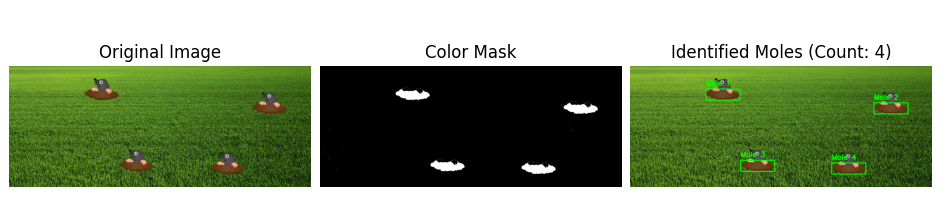

# Whac-A-Mole

### Category

Prog

### Difficulty

Very Easy

### Author

Log_s

### Description

The Whac-A-Mole game is fairly simple. But knowing how many moles there is a clear plus. Can you count them for me?

TCP: `nc prog.heroctf.fr 8000`

**Note to begginers #1**:*Croping a mole model out, and using an exact pixel comparison is often not the best way to approach this problem. This is mainly due to different softwares blending pixels together when pasting an image on an other. In the current case, the background image and the moles have pretty different main colors. You could use this to create [a mask](https://medium.com/@sunil.veera/exploring-color-manipulation-in-images-with-opencv-masking-vs-custom-color-selection-803d9742969c). The opencv function `connectedComponentsWithStats` can count elements, when provided with a mask.*

**Note to begginers #2**: *An AI model would find a working solution very easily. I would however advise to try and work out a solution yourself if speed is not of the essence for you.* 

**Note to begginers #3**: *Please find attached a template that will help you handle the interactions with the challenge.*

### Files

- [template.py](./files/template.py)

### Write Up

As explained in the challenge's description, a good approach (far from the only one) is using masks.

The solve script is available here: [solve.py](./files/solve.py).

Here are some details. First, we need to convert the base64 encoded string to a format that can be processed by opencv.
```python
# Decode base64 → NumPy image
img_bytes = base64.b64decode(b64img)
img = Image.open(BytesIO(img_bytes)).convert("RGB")
img_np = np.array(img)
img_cv = cv2.cvtColor(img_np, cv2.COLOR_RGB2BGR)

# Convert to HSV
hsv = cv2.cvtColor(img_cv, cv2.COLOR_BGR2HSV)
```

We can then define a range of brown colors (to match the dirt in the mole images), and create a mask for it (note that it is not RBG but HSV).
```python
# Define color for the dirt
lower_brown = np.array([5, 50, 50])
upper_brown = np.array([25, 255, 200])

# Mask for the color range
mask = cv2.inRange(hsv, lower_brown, upper_brown)
```

Finally we can count the blobs exposed by the mask, and filter out the very small ones, likely due to noise.
```python
# Stats will contain the bounding box of each connected blob
_, _, stats, _ = cv2.connectedComponentsWithStats(mask)

# Filter small blobs (to avoid noise)
filtered_stats = [stat for stat in stats[1:] if stat[cv2.CC_STAT_AREA] > 200]
count = len(filtered_stats)
```



### Flag

Hero{c0l0r_m4sk1ng_4_c1u5t3r1ng_30cbdb51ae9a289fadcaa7be2f534151}
