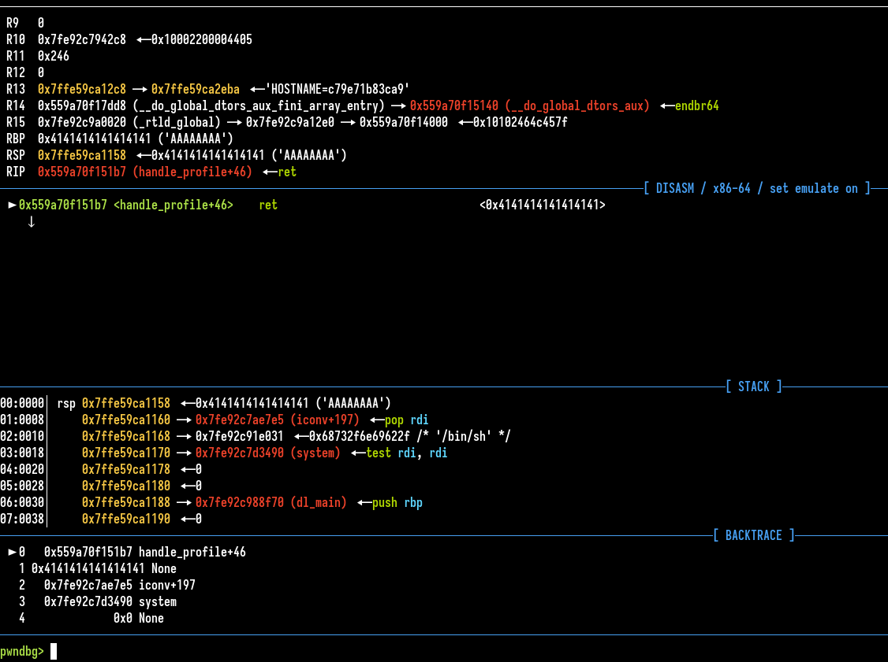
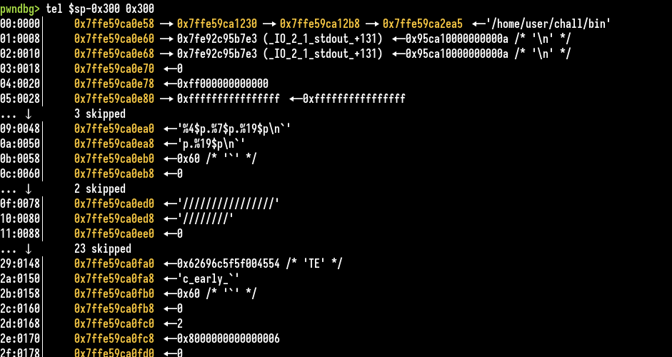
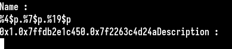

# Crash

### Category

Pwn

### Difficulty

Medium

### Author

Itarow

### Description

I have received a crash report from my server service and I lost my access to the server. The initial analysis suggests a failed binary exploitation attempt caused the crash. Help me to get access back to my server. The Dockerfile will give you an environment identical to the server, you need to use it to analyze the core dump of the exploited process and to reproduce the exploit.

Deploy an instance at https://deploy.heroctf.fr/.

### Files

- [crash_players.zip](players/crash_players.zip)

### Write Up

This challenge is a bit different from classic pwn challenges, a Dockerfile with a debian image and a coredump of a process is given.
```
$ file core
core: ELF 64-bit LSB core file, x86-64, version 1 (SYSV), SVR4-style, from '/home/user/chall/bin', real uid: 0, effective uid: 0, real gid: 0, effective gid: 0, execfn: '/home/user/chall/bin', platform: 'x86_64'
```

We need to use the dockerfile to analyze the coredump :


We can see the program is executing a ret instruction on `0x4141414141414141` address. We can guess the attacker may exploit a buffer overflow and fail to calculate the exact number of padding characters (in this case with 'A') to put before his ROP.

The ROP is placed after, we can see in on the stack section. It's a classic rop which execute a pop rdi to set "/bin/sh" address in rdi and the system address in the libc to execute a shell.

By viewing the stack before we could get more informations :


It seems there is a format string payload which was sent by the attacker : 
```
%4$p.%7$p.%19$p\n
```
We could assume this was to leak some addresses and bypass ASLR. 

If we connect to the server we can try the format string and it works :



We can assume the description input contains the buffer overflow vulnerability.

A possibility is to dump the binary from gdb command or open it in your favorite disassembler directly but the GOT in initialized so some informations might not be welled parsed.

Now the goal is to reproduce the exploit, one solution is to iterate with the format string to match addresses in the core dump and on the remote server. See [bf.py](./exploit/bf.py) for example. We can quickly match some address in the core dump with the remote ones.

Just compute one libc leak in local with the coredump and apply the same in remote.

Craft the ROP with ROP pwntools module to flag fast and add a ret to bypass movaps issue. See [solve.py](./exploit/solve.py) for full exploit.

### Flag

Hero{d2d8c417232c1b8e0abc91b8a542e55259ebbac5}
