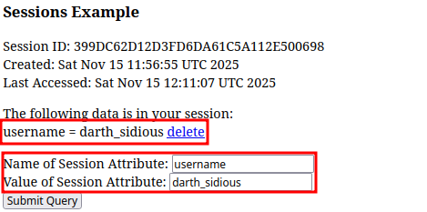
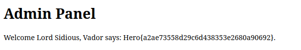

# Tomwhat

### Category

Web

### Difficulty

Easy

### Author

Worty

### Description

May The Force Be With You

Deploy an instance at [https://deploy.heroctf.fr/](https://deploy.heroctf.fr/).

### Files

- [Tomwhat.zip](Tomwhat.zip)

### Write Up

In this challenge, the most important file is `run.sh`, in fact, we can see that this file performs lots of operations on configuration files of several webapps :

- Allows access to restrict tomcat administrative services from anywhere :

```sh
files="$(grep -Rl 'RemoteCIDRValve' $CATALINA_HOME/conf $CATALINA_HOME/webapps || true)" && \
    for f in $files; do \
      sed -i 's/allow="127.0.0.0\/8,::1\/128"/allow="0.0.0.0\/0,::\/0"/' "$f"; \
    done
```

- Forces sessions to be shared between webapps (I mean, for EVERY webapp available) :

```sh
find $CATALINA_HOME -name "context.xml" -print0 | while IFS= read -r -d '' f; do \
      sed -i 's/<Context>/<Context sessionCookiePath="\/">/' "$f"; \
      sed -i '/<\/Context>/i\    <Valve className="org.apache.catalina.valves.PersistentValve"/>\n    <Manager className="org.apache.catalina.session.PersistentManager">\n        <Store className="org.apache.catalina.session.FileStore" directory="'"$CATALINA_HOME"'/temp/sessions"/>\n    </Manager>' "$f"; \
done
```

Finally, this file compiles the two minimal webapps. Those are created to demonstrate that sessions are shared between webapps, in fact, if you enter the username "Worty" on the light one, displayed message will be `You are on the good side Lord Worty`, but if we directly switch to the `dark` webapp, without entering any username, the displayed message will be `Welcome to the dark side Darth Worty`, we understand here that sessions are shared between webapps. However, we are not authorized to register with the username `darth_sidious`, so it's kind of impossible at first glance to get the flag.

Remember that in the `run.sh` file, we allow any unauthenticated user to access ALL webapps, this includes the `manager` (but the password is a random uuid), but also the `examples` one ! In those examples, one allows you to create sessions with arbitrary attributes, but... sessions are shared ? :D

It's therefore possible to reach the page at `/examples/servlets/servlet/SessionExample`, and create a session with the following attributes :



We can now reach the admin interface and get the flag!



### Flag

Hero{a2ae73558d29c6d438353e2680a90692}
